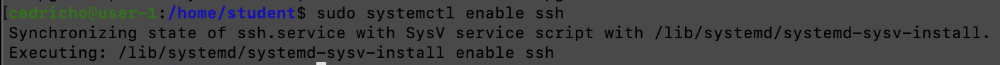
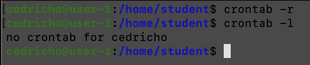

# D01-Linux

## Part 1. Установка ОС
---------

* Вывод версии Ubuntu при помощи ***cat /etc/issue***

## Part 2. Создание пользователя
---------

* Создание нового пользователя командой ***sudo adduser***

* Добавление пользователя в группу adm

* Вывод команды ***cat /etc/passwd*** 

## Part 3. Настройка сети ОС
---------

* Задание названия машины вида user-1 при помощи ***sudo hostnamectl set-hostname user-1***

* Установка временной зоны Новосибирска при помощи ***sudo timedatectl set-timezone Asia/Novosibirsk***

* Вывод названий сетевых интерфейсов при помощи ***ls /sys/class/net***

* **lo** - интерфейс, который используется для отладки сетевых программ и запуска серверных приложений на локальной машине. Дополнительное средство в устранении проблем физического соединения.

*  Получение ip-адреса устройства, на котором мы работаем, от DHCP сервера при помощи ***hostname -I***

* Dynamic Host Configuration Protocol (DHCP) — это протокол прикладного уровня, который помогает назначать IP-адреса устройствам при подключении к серверу. Протокол DHCP автоматизирует выдачу адресов, а также их передачу следующим пользователям после отключения устройств или их перехода из одной подсети в другую. Протокол динамического присвоения IP-адресов функционирует по принципу DORA.

* Вывод на экран внешнего IP-адреса шлюза при помощи ***curl ifconfig.me***

* Вывод на экран внутреннего IP-адреса шлюза при помощи ***ip route***

* Внесение настроек ip, gw, dns вручную через команду ***sudo vim /etc/netplan/00-installer-config.yaml***
* Применяем изменения командой ***sudo netplan apply***

 

* Убеждаемся, что статичные сетевые настройки сохранились после перезагрузки виртуальной машины

* Успешно пингуем 1.1.1.1 и ya.ru по 4 раза

## Part 4. Обновление ОС
---------
* Обновление всех пакетов до последней версии делаем при помощи ***sudo apt-get upgrade***

* При повторном вводе команды убеждаемся, что обновления отсутствуют

## Part 5. Использование команды sudo
---------
* **Команда sudo** предоставляет возможность пользователям выполнять команды от имени суперпользователя root, либо других пользователей. Правила, используемые sudo для принятия решения о предоставлении доступа, находятся в файле /etc/sudoers.

* Добавление пользователя cedricho в группу sudo команой  ***sudo su*** и смена имени машины от его имени.

## Part 6. Установка и настройка службы времени
---------

* Вывод timedatectl show, наличие NTPSynchronized=yes

## Part 7. Установка и использование текстовых редакторов
---------

* Установка MCEDIT командой ***sudo apt-get install mcedit***

* Файл test_vim.txt с cedricho.
* Выход с изменениями: Esc, :wq, Enter

* Файл test_nano.txt с cedricho.
* Выход с изменениями: Ctrl+x, Y, Enter

* Файл test_mcedit.txt с cedricho.
* Выход с изменениями: Esc, Yes, Enter

* Файл test_vim.txt с изменениями.
* Выход без изменений: Esc, :q, Enter

* Файл test_nano.txt с изменениями.
* Выход без изменений: ctrl+x, N

* Файл test_mcedit.txt с изменениями.
* Выход без изменений: Esc, No, Enter

* Результаты поиска в VIM.
* Поиск: нажать '/', ввести нужную строку. Совпадение выделяется.

* Результат поиска в NANO.
* Поиск: ctrl + w, ввод нужной строки, enter. Курсор перемещается к началу совпадения, появляется информация о количестве совпадений.

* Результаты поиска в MCEDIT.
* Поиск: F7, ввод нужной строки, нажать ok.

* VIM с командой для замены слова на другое.
* Команда для замены: :s/cedricho/I_Love_Verter.

* NANO с командой для замены слова на другое.
* Замена: ctrl + \, ввод строки. Затем ввод новой строки. Yes

* MCEDIT с командой для замены слова на другое.
* F4, ввод искомой строки, ввод замены. Далее нажать "Replace".

## Part 8. Установка и базовая настройка сервиса SSHD
---------

* Установка SSHd командой ***sudo apt-get install openssh-server***

* Включение автостарта службы командой ***sudo systemctl enable ssh***

* Перенастройка службы на порт 2022: 
* Открытия файла конфигурации командой ***vim /etc/ssh/sshd_config***

* Строка Port 22 изменена на Port 2022

* Перезапуск службы командой ***sudo systemctl restart sshd***

* Вывод наличия процесса sshd командой ***ps -aux | grep ssh***

* **Утилита 'ps'** - программа для определения работающих в системе программ и оценки используемых ими ресурсов. Она выводит статистику и информацию о состоянии процессов в системе, в том числе ИД процесса или нити, объем выполняемого ввода-вывода и используемый объем ресурсов процессора и памяти.

**Ключи команды** <u>ps</u>:
* -A, -e - выбор всех процессы
* -a - выбор всех процессов, кроме фоновых
* -d - выбор всех процессов, включая фоновые, кроме процессов сессий
* -N - выбор всех процессов, кроме указанных
* -C - выбор процессов по имени команды
* -G - выбор процессов по ID группы
* -p - выбор процессов PID
* --ppid - выбор процессов по PID родительского процесса
* -s - выбор процессов по ID сессии
* -t - выбор процессов по tty
* -u - выбор процессов пользователя
* -x - найти все вхождения строки поиска
* -c - отображение информации планировщика
* -f - вывод максимума доступных данных
* -F - выводит больше данных
* -l - длинный формат вывода
* -j - вывод процессов Jobs
* -M - добавить информацию о безопасности
* -o - позволяет определить свой формат вывода
* --sort - выполняет сортировку указанной колонки
* -L - отображать потоки процессов в колонках LWP и NLWP
* -m - вывести потоки после процесса
* -V - вывести информацию о версии
* -H - отображать дерево процессов

* Перезагрузка системы командой ***sudo reboot***

* Загрузка утилиты netstat командой ***sudo apt install net-tools***

* Вывод команды netstat -tan

**Значение ключей -tan, значения каждого столбца, значение 0.0.0.0.**

* -t - отображает текущее подключение в состоянии переноса нагрузки с процессора на сетевой адаптер при передаче данных.
* -a - отображает все подключения и ожидающие порты.
* -n - отображает все адреса и номера портов в числовом формате.
* Proto - протокол, используемый сокетом. 
* Recv-Q - счётчик байт, не скопированных программой пользователя из этого сокета.
* Send-Q - счётчик байт, не подтверждённых удалённым узлом.
* Local Address - адрес и номер порта локального конца сокета.
* Foreign Address - адрес и номер порта удалённого конца сокета.
* State - Состояние сокета. LISTEN - Сокет ожидает входящих подключений. ESTABLISHED - Сокет находится в состянии установленного подключения.
* 0.0.0.0 означает «любой IP данного компьютера». Адрес 0.0.0.0 обычно означает, что IP адрес ещё не настроен или не присвоен. Адрес указывает хост, который обращается к DHCP для получения IP адреса.

## Part 9. Установка и использование утилит top, htop
---------

* **Запуск и вывод команды top.**

* Uptime - 11 минут.

* Количество автовизированных пользователей.

* Загрузка системы.

* Количество всех процессов.

* Загрузка cpu - 0.2%, они отведены под процессы ядра.

* Загрузка памяти.

* PID процесса, который занимает больше всего процессорного времени и памяти - 953.

**Запуск htop командой htop**

* Вывод команды, отсортированный по PID.

* Вывод команды, отсортированный по CPU.

* Вывод команды, отсортированный по MEM.

* Вывод команды, отсортированный по TIME.

* Вывод с фильтром по процессу sshd.

* Процесс syslog.

* Добавлен вывод hostname, clock, uptime.

## Part 10. Использование утилиты fdisk
---------
* Вывод при помощи команды ***sudo fdisk -l***

* Название - sda. Размер 16GB. Кол-во секторов - 33554432. Swap не создавался.

## Part 11. Использование утилиты df
---------

* Запуск командой ***sudo df.***

* Корневой раздел - 16445308кб.
* Занятое пространство - 6693212кб.
* Свободное пространство - 8897008кб.
* Процент использования - 43%.

* Запуск командой ***sudo df -Th.***

* Размер раздела - 16GB.
* Занятое пространство - 6.4GB.
* Свободное пространство - 8.5GB.
* Процент использования - 43%.
* Тип файловой системы для раздела - ext4.

## Part 12. Использование утилиты du
---------

* Запуск командой ***sudo du***

* Вывод размеров папок /home и /var командой ***sudo du -h -d 0 /home /var***
* Вывод размера папки log командой ***sudo du -h -d 0 /var/log***

* Вывод всего содержимого /var/log командой ***sudo du -h -d 0 /var/log/* ***

## Part 13. Установка и использование утилиты ncdu
---------

* Установка утилиты командой ***sudo apt install ncdu***

* Вывод командой ***sudo ncdu /home***

* Вывод командой ***sudo ncdu /var***

* Вывод командой ***sudo ncdu var/log***

## Part 14. Работа с системными журналами
---------

* Просмотр /var/log/dmesg командой ***less /var/log/dmesg***

* Просмотр /var/log/syslog командой ***less /var/log/syslog***

* Просмотр /var/log/auth.log командой ***less /var/log/auth.log***

* Время последней успешной авторизации, имя пользователя и метод входа в систему. Команда ***sudo grep -ai LOGIN /var/log/auth.log***
* Время авторизации - 07:58, имя пользователя - cedricho, метод входа - login.

* Перезапуск службы SSHd командой ***sudo systemctl restart sshd.***

*  Информация о рестарте sshd службы в логах "auth.log", команда: ***sudo grep -a restart /var/log/auth.log***

## Part 15. Использование планировщика заданий CRON

* Создание задачи в cron.

* uptime каждые 2 минуты.

* Вывод списка задач.

* Удаление всех задач и вывод нового списка.