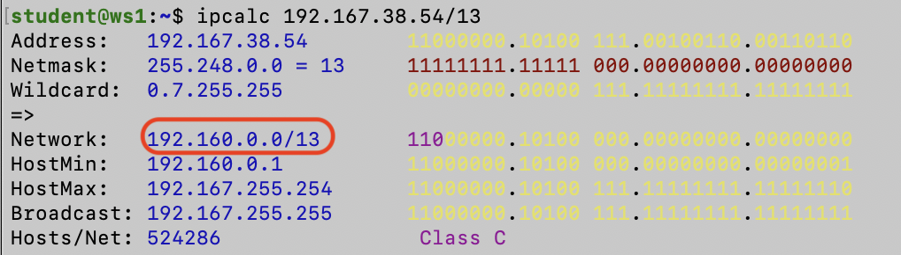
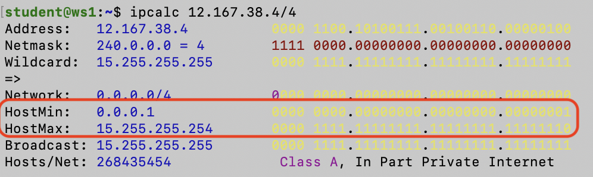
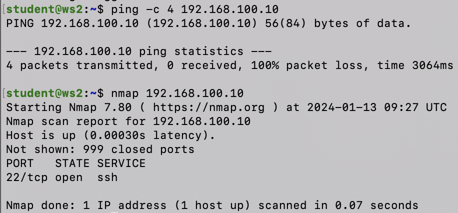
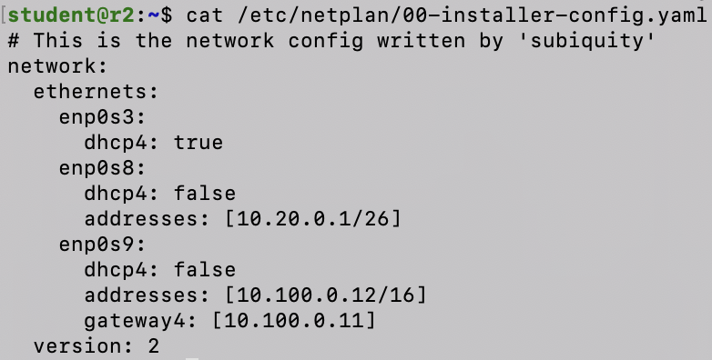
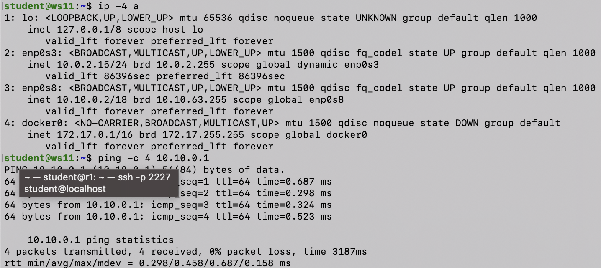
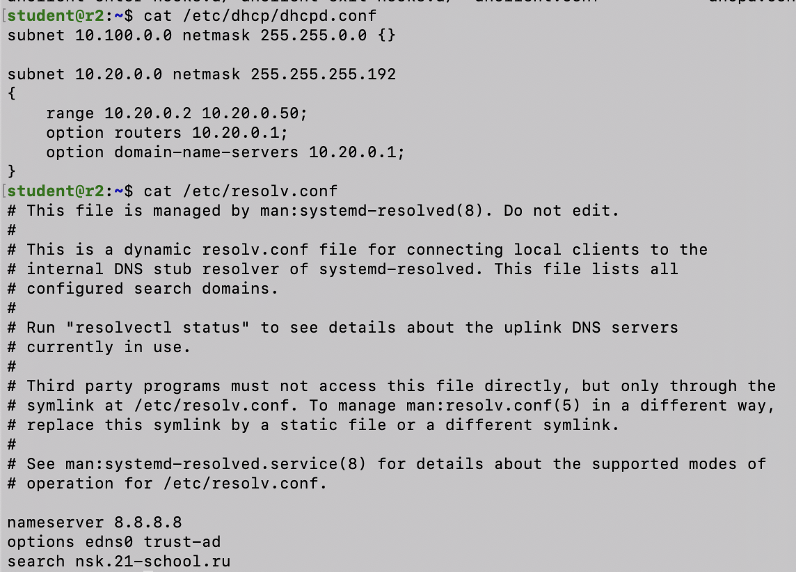
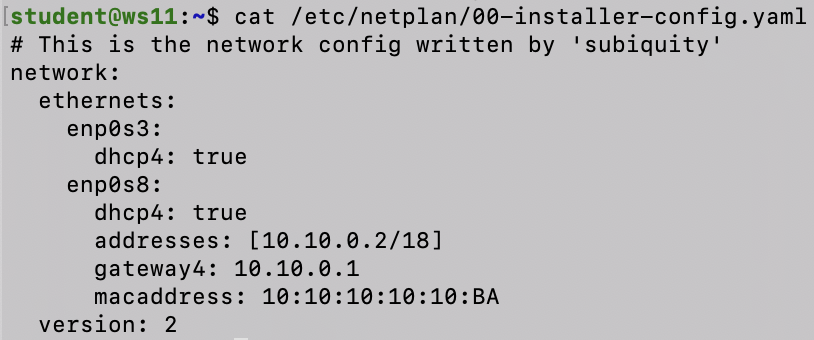
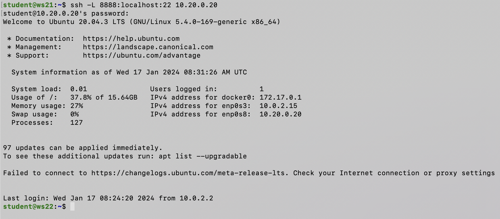
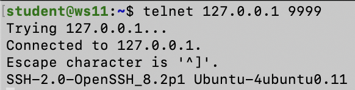

# D02-Linux Network
## Part 1. Инструмент ipcalc

### 1.1. Сети и маски
* Устанавливаем ipcalc при помощи ***sudo apt-get install ipcalc***


* С помощью команды ***ipcalc -n 192.167.38.54/13*** узнаем адрес сети


* Перевод маски 255.255.255.0 в префиксную и двоичную запись


* Перевод маски /15 в обычную и двоичную запись


* Перевод маски 11111111.11111111.11111111.11110000 в обычную и префиксную


*  Минимальный и максимальный хост в сети 12.167.38.4 при маске: /8


*  Минимальный и максимальный хост в сети 12.167.38.4 при маске: 11111111.11111111.00000000.00000000


*  Минимальный и максимальный хост в сети 12.167.38.4 при маске: 255.255.254.0


*  Минимальный и максимальный хост в сети 12.167.38.4 при маске: /4


### 1.2. localhost

* Локальные IP-адреса находятся в диапазоне ***[127.0.0.1 - 127.255.255.254]***

1. 194.34.23.100 - нельзя обратиться
2. 127.0.0.2 - можно обратиться
3. 127.1.0.1 - можно обратиться
4. 128.0.0.1 - нельзя обратиться

### 1.3. Диапазоны и сегменты сетей

### № 1.
* Частные IP-адреса находятся в диапозонах:

    ***[10.0.0.0 - 10.255.255.255], [172.16.0.0 - 172.31.255.255], [192.168.0.0 - 192.168.255.255]***

* Публичные IP-адреса находятся в диапозонах:

    ***[1.0.0.0 - 126.255.255.255], [128.0.0.0 - 191.255.255.255], [192.0.0.0 - 223.255.255.255], [224.0.0.0 - 239.255.255.255], [240.0.0.0 - 255.255.255.255]***

1. 10.0.0.45 - частный
2. 134.43.0.2 - публичный
3. 192.168.4.2 - частный
4. 172.20.250.4 - частный
5. 172.0.2.1 - публичный
6. 192.172.0.1 - публичный
7. 172.68.0.2 - публичный
8. 172.16.255.255 - частный
9. 10.10.10.10 - частный 
10. 192.169.168.1 - публичный
----

### № 2.
* Для сети с префиксом /18 диапазон возможных IP-адресов будет ***[10.10.0.1 - 10.10.63.254]***

1. 10.0.0.1 - невозможен
2. 10.10.0.2 - возможен 
3. 10.10.10.10 - возможен
4. 10.10.100.1 - невозможен
5. 10.10.1.255 - возможен

## Part 2. Статическая маршрутизация между двумя машинами
* С помощью команды ip a смотрим существующие сетевые интерфейсы


* Описали сетевой интерфейс, соответствующий внутренней сети, на обеих машинах и задали следующие адреса и маски: ws1 - 192.168.100.10, маска /16, ws2 - 172.24.116.8, маска /12,  также выполнили команду netplan apply для перезапуска сервиса сети

-----

### 2.1. Добавление статического маршрута вручную

* Добавили статический маршрут от одной машины до другой и обратно при помощи команды вида ip r add и пропинговали соединение между машинами

-----

### 2.2. Добавление статического маршрута с сохранением

* Добавили статический маршрут от одной машины до другой с помощью файла etc/netplan/00-installer-config.yaml и пропинговали соединение между машинами

-----

## Part 3. Утилита iperf3

### 3.1. Скорость соединения

| <!-- -->    | <!-- -->  | 
|:-----------:|:---------:|
| 1 байт      | 8 бит     | 
| 1 MB        | 1024 KB   | 
| 1 KB        | 1024 байта| 
| 1 Gbps      | 1000 Mbps | 

 ***1. 8 Mbps = 1 MB/s***

 ***2. 100 MB/s = 800000 Kbps***

 ***3. 1 Gbps = 1000 Mbps***

-----

### 3.2. Утилита iperf3

* Измерили скорость соединения между ws1 и ws2

-----

## Part 4. Сетевой экран

### 4.1. Утилита iptables

* Создал файл /etc/firewall.sh, имитирующий фаерволл, на ws1 и ws2


* Запустил файлы на обеих машинах командами chmod +x /etc/firewall.sh и /etc/firewall.sh

```
Разница в стратегиях:
1. В первом скрипте для ws1 (файл /etc/firewall.sh):
- В начале устанавливается стратегия, при которой все соединения запрещены, а затем разрешаются необходимые соединения (loopback, SSH, HTTP).
- Это стратегия "запретить всё и потом разрешить необходимое".
2. Во втором скрипте для ws2 (файл /etc/firewall.sh):
- В начале устанавливается стратегия, при которой все соединения разрешены, а затем запрещаются нежелательные соединения (echo reply).
- Это стратегия "разрешить всё и потом запретить нежелательное".

Различия в стратегиях зависят от того, какой тип соединений вы хотите управлять: начинать с полного запрета и разрешать нужные, или начинать с полного разрешения и запрещать нежелательные.
```
----s

### 4.2. Утилита nmap

* Командой ping нашел машину, которая не "пингуется", после чего утилитой nmap показал, что хост машины запущен

----

## Part 5. Статическая маршрутизация сети

### 5.1. Настройка адресов машин

* Настроил конфигурации машин в etc/netplan/00-installer-config.yaml согласно сети на рисунке.


* Перезапустил сервис сети. Командой ip -4 a проверил, что адрес машины задан верно. Также пропинговал ws22 с ws21. Аналогично пропинговал r1 с ws11.

-------

### 5.2. Включение переадресации IP-адресов.

* Включил переадресацию IP на роутерах с помощью команды ***sysctl -w net.ipv4.ip_forward=1***


* Открыл файл /etc/sysctl.conf и добавил в него следующую строку: ***net.ipv4.ip_forward = 1***

-----

### 5.3. Установка маршрута по-умолчанию

* Настроил маршрут по-умолчанию (шлюз) для рабочих станций. Для этого добавил default перед IP роутера в файле конфигураций


* Пропинговал с ws11 роутер r2 и показал на r2, что пинг доходит. Для этого использовал команду: ***tcpdump -tn -i enp0s8***

----

### 5.4. Добавление статических маршрутов

* Добавил в роутеры r1 и r2 статические маршруты в файле конфигураций. Вызвал **ip r** и показал таблицы с маршрутами на обоих роутерах.


* Запустил команды на ws11: **ip r list 10.10.0.0/18** и **ip r list 0.0.0.0/0**


```
Маршрут по умолчанию (0.0.0.0/0) используется, когда устройство не знает более конкретного маршрута для определенной подсети. Он служит как "последнее средство", когда другие более специфичные маршруты не применяются.
```
----

### 5.5. Построение списка маршрутизаторов

* Запустил на r1 команду дампа: ***tcpdump -tnv -i eth0***. При помощи утилиты **traceroute** построил список маршрутизаторов на пути от ws11 до ws21

----

### 5.6. Использование протокола ICMP при маршрутизации

* Запустил на r1 перехват сетевого трафика, проходящего через eth0 с помощью команды: ***tcpdump -n -i eth0 icmp***. Пропинговал с ws11 несуществующий IP (например, 10.30.0.111) с помощью команды: ***ping -c 1 10.30.0.111***

----

## Part 6. Динамическая настройка IP с помощью DHCP

* Для r2 настроил в файле **/etc/dhcp/dhcpd.conf** конфигурацию службы DHCP. В файле **resolv.conf** прописал nameserver ***8.8.8.8***.


* Перезагрузил службу DHCP командой ***systemctl restart isc-dhcp-server***. Машину ws21 перезагрузил при помощи ***reboot*** и через ip a показал, что она получила адрес. Также пропинговал ws22 с ws21.


* Указал MAC адрес у ws11, для этого в ***etc/netplan/00-installer-config.yaml*** добавил строки: ***macaddress: 10:10:10:10:10:BA, dhcp4: true***


* Для r1 настроил аналогично r2, но сделал выдачу адресов с жесткой привязкой к MAC-адресу (ws11). Пропинговал ws11 с ws21. 


* Запросил с ws21 обновление ip адреса с помощью команды ***sudo dhclient enp0s8***. На скринае можно увидеть различия ip до и после обновления.

----

## Part 7. NAT

* В файле ***/etc/apache2/ports.conf*** на ws22 и r1 изменил строку **Listen 80** на **Listen 0.0.0.0:80**, то есть сделал сервер Apache2 общедоступным. Запустил веб-сервер Apache командой ***service apache2 start*** на ws22 и r1.


* Добавил в фаервол, созданный по аналогии с фаерволом из Части 4, на r2 следующие правила:
1) удаление правил в таблице filter - iptables -F
2) удаление правил в таблице "NAT" - iptables -F -t nat
3) отбрасывать все маршрутизируемые пакеты - iptables --policy FORWARD DROP
* Запустил файл также, как в Части 4. Проверил соединение между ws22 и r1 командой ping


* Добавил в файл ещё одно правило:
4) разрешить маршрутизацию всех пакетов протокола ICMP
* Запустил файл также, как в Части 4. Проверил соединение между ws22 и r1 командой ping


* Добавил в файл ещё два правила:
5) включить SNAT, а именно маскирование всех локальных ip из локальной сети, находящейся за r2 (по обозначениям из Части 5 - сеть 10.20.0.0)
6) включить DNAT на 8080 порт машины r2 и добавить к веб-серверу Apache, запущенному на ws22, доступ извне сети


* Проверил соединение по TCP для SNAT, для этого с ws22 подключиться к серверу Apache на r1 командой: ***telnet 10.10.0.1 80***
* Проверил соединение по TCP для DNAT, для этого с r1 подключиться к серверу Apache на ws22 командой ***telnet 10.20.0.1 8080***

----

## Part 8. Дополнительно. Знакомство с SSH Tunnels

* Запустил на r2 фаервол с правилами из Части 7. Запустил веб-сервер Apache на ws22 только на localhost (в файле /etc/apache2/ports.conf изменил строку ***Listen 80*** на ***Listen localhost:80***)


* Воспользовался Local TCP forwarding с ws21 до ws22, чтобы получить доступ к веб-серверу на ws22 с ws21


* Воспользовался Remote TCP forwarding c ws11 до ws22, чтобы получить доступ к веб-серверу на ws22 с ws11 (прописываем именно с ws22)


* Для проверки, сработало ли подключение в обоих предыдущих пунктах, перешел во второй терминал и выполнил команду: ***telnet 127.0.0.1***

