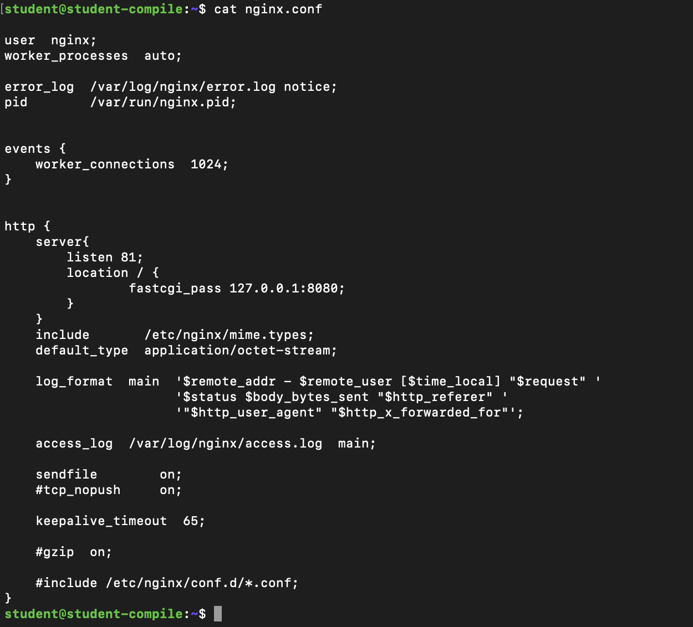

# Simple Docker
## Part 1. Готовый докер

* Взяли официальный докер-образ с nginx и выкачали его при помощи **docker pull**.

* Проверили наличие докер-образа через **docker images**.

* Запустили докер-образ через **docker run -d nginx**

* Проверили, что образ запустился через **docker ps**.

* Посмотрели информацию о контейнере через **docker inspect 7b982c5fc45f**. По выводу команды определили и поместили в отчёт размер контейнера, список замапленных портов и ip контейнера.

* Остановили докер образ через **docker stop 7b982c5fc45f**.

* Проверели, что образ остановился через **docker ps**.

* Запустили докер с портами 80 и 443 в контейнере, замапленными на такие же порты на локальной машине, через команду **run**.

* Проверили, что в браузере по адресу localhost:80 доступна стартовая страница nginx.

* Перезапустили докер контейнер через **docker restart 7189e9af3de4**. Проверили, что контейнер запустился.

-----

## Part 2. Операции с контейнером

* Прочитали конфигурационный файл nginx.conf внутри докер контейнера через команду exec. Создали на локальной машине файл nginx.conf

* Настроили в нем по пути /status отдачу страницы статуса сервера nginx.

* Скопировали созданный файл nginx.conf внутрь докер-образа через команду **docker cp**. Перезапустили nginx внутри докер-образа через команду exec. Проверили, что по адресу localhost:80/status отдается страничка со статусом сервера nginx.

* Экспортировали контейнер в файл container.tar через команду export.

* Остановили контейнер.

* Удалили образ через **docker rmi** b690f5f0a2d5, не удаляя перед этим контейнеры.

* Удалили остановленный контейнер.

* Импортировали контейнер обратно через команду import. Запустили импортированный контейнер. Проверили, что по адресу localhost:80/status отдается страничка со статусом сервера nginx.

## Part 3. Мини веб-сервер

* Написали мини-сервер на C и FastCgi, который будет возвращать простейшую страничку с надписью ***Hello World!***.

* Запустили написанный мини-сервер через spawn-fcgi на порту 8080.

* Написали свой nginx.conf, который будет проксировать все запросы с 81 порта на 127.0.0.1:8080.

* Проверили, что в браузере по localhost:81 отдается написанная тобой страничка.

# Part 4. Свой докер

* Собрали написанный докер-образ через docker build при этом указав имя и тег.

* Проверили через docker images, что все собралось корректно.

* Запустли собранный докер-образ с маппингом 81 порта на 80 на локальной машине и маппингом папки ./nginx внутрь контейнера по адресу, где лежат конфигурационные файлы nginx'а. Проверили, что по localhost:80 доступна страничка написанного мини сервера.

* Дописали в ./nginx/nginx.conf проксирование странички /status, по которой надо отдавать статус сервера nginx.

* Перезапустили докер-образ. Проверили, что теперь по localhost:80/status отдается страничка со статусом nginx.

# Part 5. Dockle

* Просканировали образ из предыдущего задания через ***dockle [image_id|repository]***.

* Исправили образ так, чтобы при проверке через dockle не было ошибок и предупреждений.

# Part 6. Базовый Docker Compose

* Написали файл docker-compose.yml, с помощью которого подняли докер-контейнер из Части 5, а также подняли докер-контейнер с nginx, который будет проксировать все запросы с 8080 порта на 81 порт первого контейнера. Замапили 8080 порт второго контейнера на 80 порт локальной машины.

* Остановили все запущенные контейнеры.

* Собрали и запустили проект с помощью команд ***docker-compose build*** и ***docker-compose up***.

* Проверили, что в браузере по localhost:80 отдается написанная тобой страничка, как и ранее.

