# Basic Kubernetes

## Part 1. Использование готового манифеста

1) Запустил окружение Kubernetes с памятью 4GB с помощью команды `minikube start --memory=4096`.
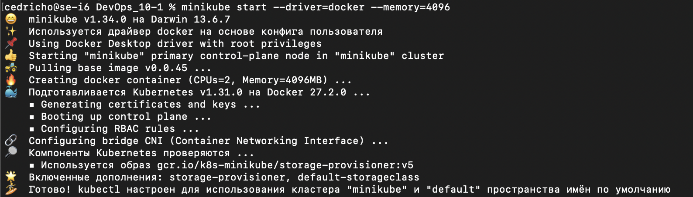

2) Применил манифест из директории /src/example к созданному окружению Kubernetes с помощью команды `minikube apply -f`.
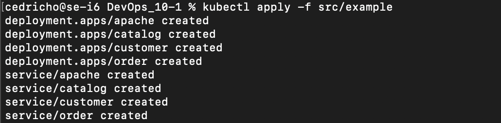

3) Запустил стандартную панель управления Kubernetes с помощью команды `minikube dashboard`.
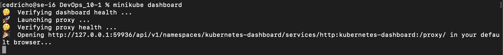
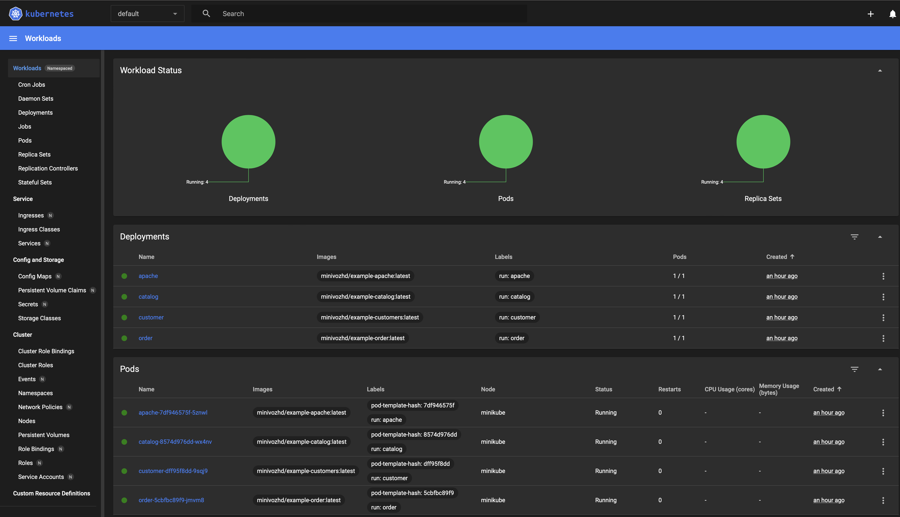

4) Прокинул тунели для доступа к развернутым сервиса с помощью команды `minikube services`.
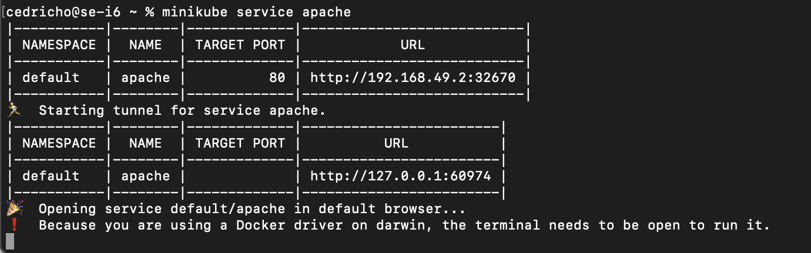

5) Удостоверился в работоспособности развернутого приложения, открыв в браузере страницу приложения (сервис apache)
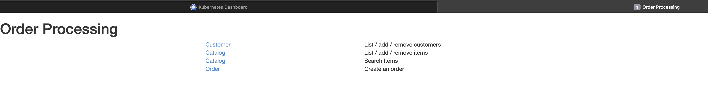

## Part 2. Написание собственного манифеста

1) Написал собственные yml-файлы манифестов для приложения из первого проекта, реализующие следующее:
   - карту конфигурации со значениями хостов БД и сервисов
   - секреты с паролем и логином к БД и ключами межсервисной авторизации
   - поды и сервисы для всех модулей приложения: postgres, rabbitmq и 7 сервисов приложения. Для всех сервисов использовать единственную реплику.

    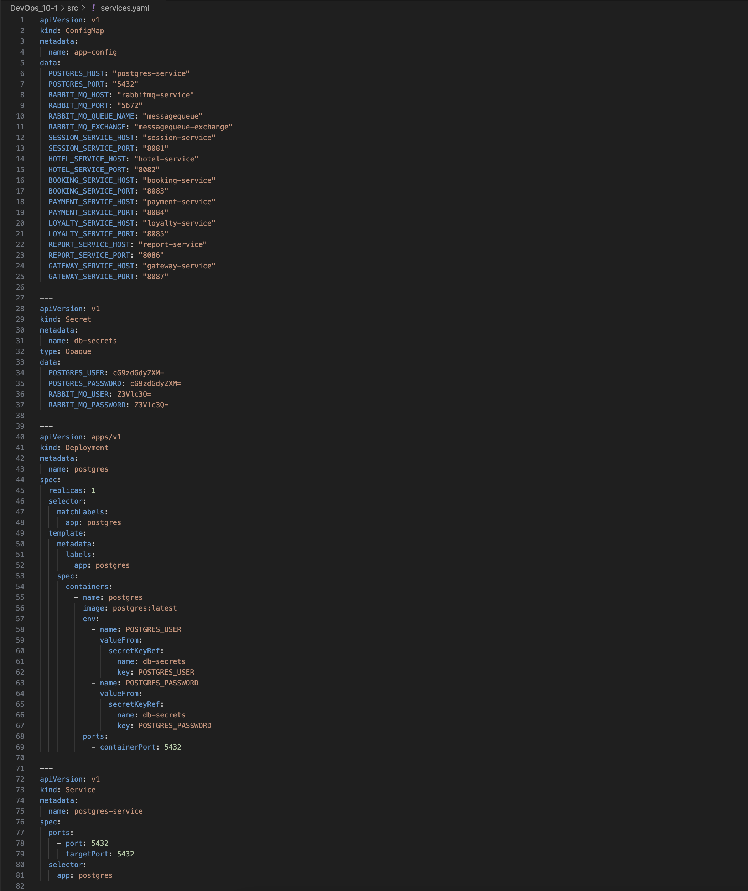

2) Запустиk приложение путем последовательного применения манифестов командой `kubectl apply -f services.yaml`.
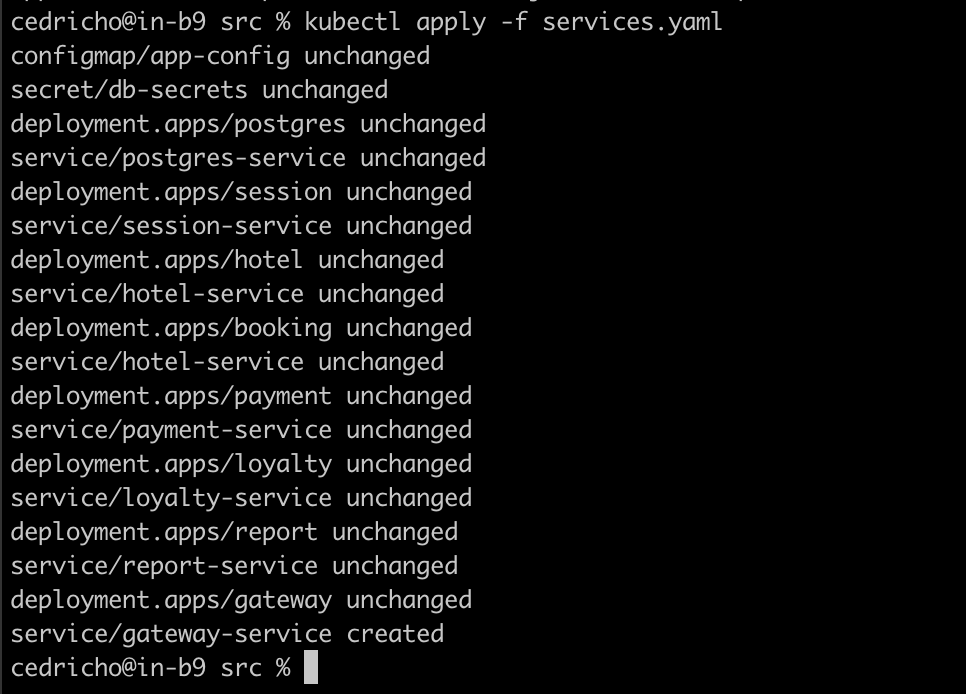

3) Проверил статус созданных объектов (секреты, конфигурационная карта, поды и сервисы) в кластере с помощью команд `kubectl get <тип_объекта> <имя_объекта>` и `kubectl describe <тип_объекта> <имя_объекта>`.
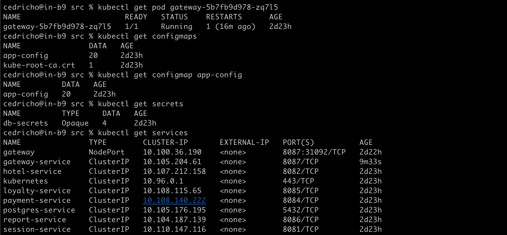
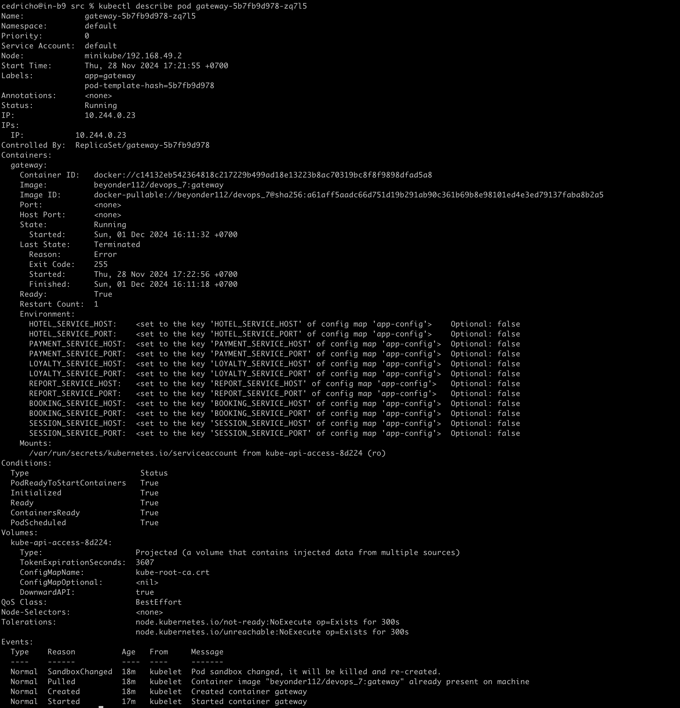

4) Проверил наличие правильных значений секретов, применив команду: `kubectl get secret db-secrets -o jsonpath='{.data.POSTGRES_PASSWORD}' | base64 --decode` для декодирования секрета.

5) Проверил логи приложения, запущенного в кластере командой `kubectl logs gateway-5b7fb9d978-zq7l5`.
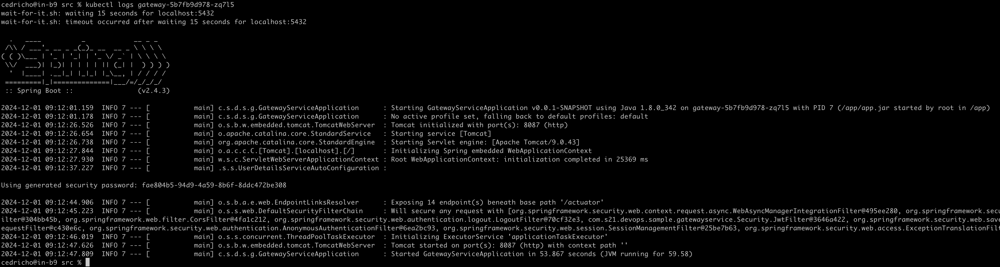

6) Прокинул тунели для доступа к gateway service и session service.
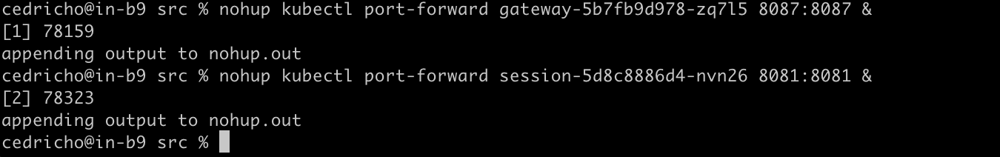

7) Запустил функциональные тесты postman и удостоверился в работоспособности приложения.
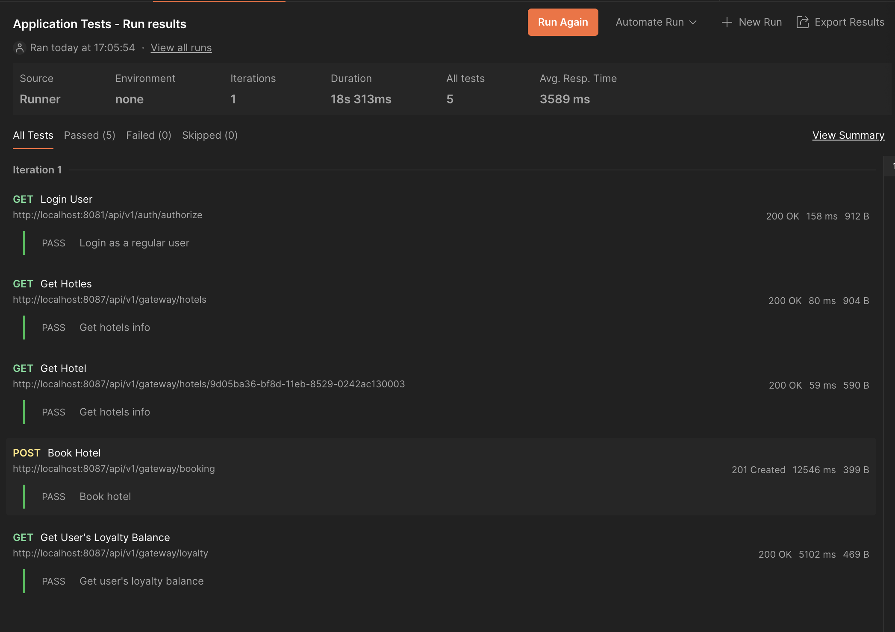

8) Запустил стандартную панель управления Kubernetes с помощью команды `minikube dashboard`.
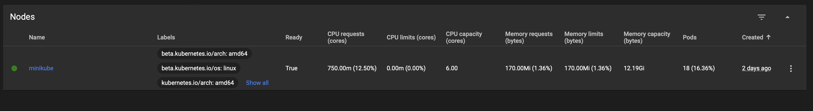
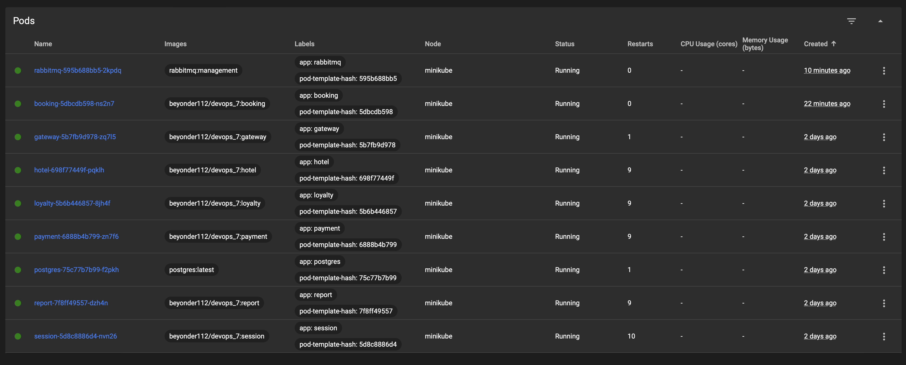
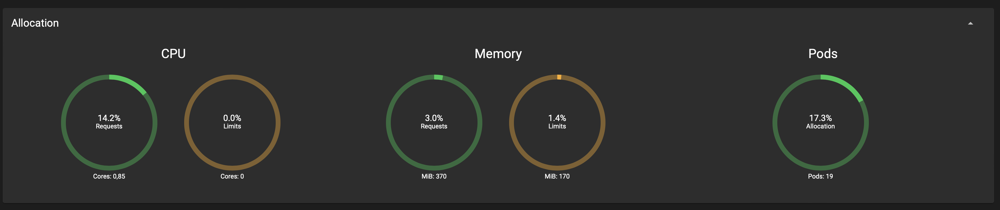
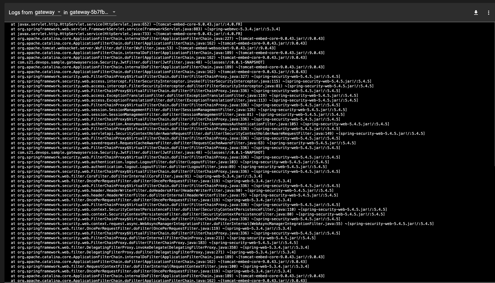
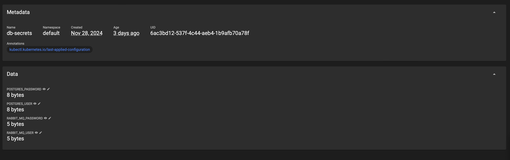
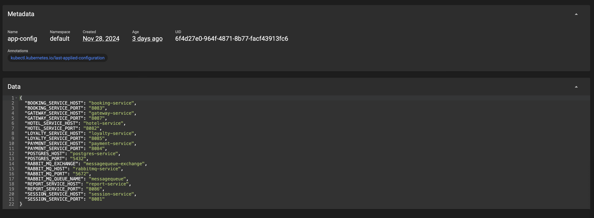

9) Обновил приложение (добавив новую зависимость в pom-файл), и пересобрать приложение со следующими стратегиями развертывания:

| Стратегия                     | Время переразвертывания |
|-------------------------------|-------------------------|
| Пересоздание (Recreate)      | 1.68s user 0.11s system 130% cpu 1.375 total  |
| Последовательное обновление (Rolling) | 1.68s user 0.11s system 129% cpu 1.383 total |

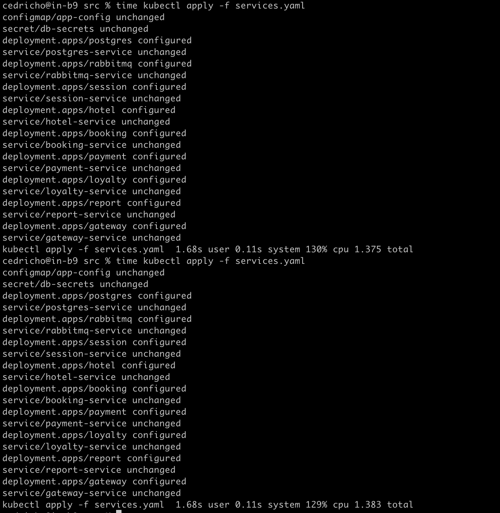
