# Advanced Kubernetes

## Part 1. Развертывание собственного кластера k3s

1) Поднял 3 виртуальные машины и установил k3s на них. При установке не использовал стандартный Ingress Controller при помощи флага `--disable=traefik`.
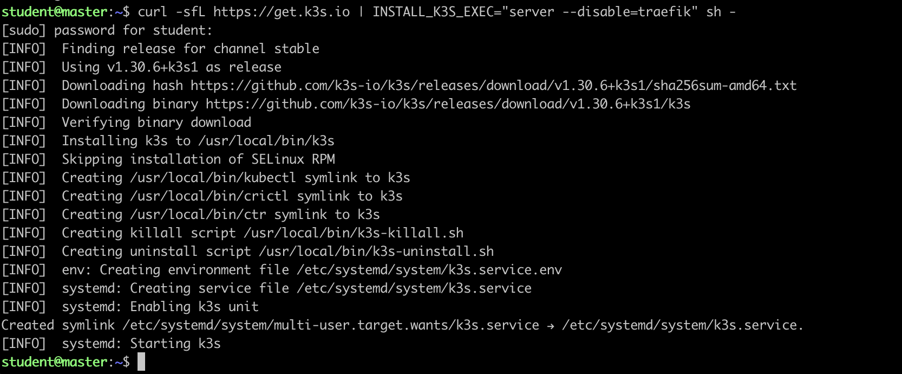
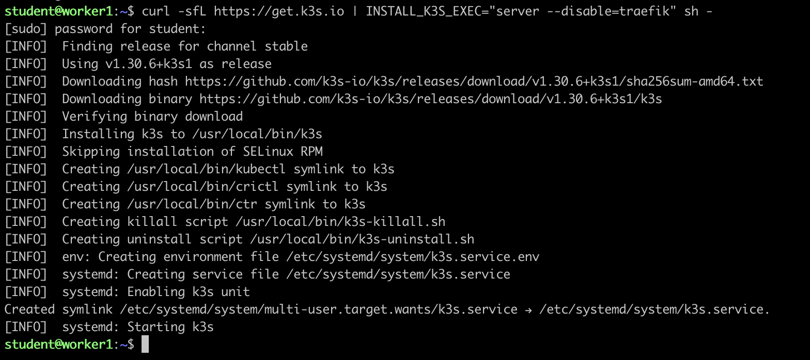
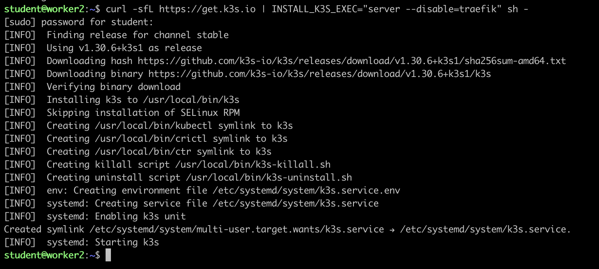

2) Получил токен мастер ноде и далее выполнил подключение узлов к кластеру.
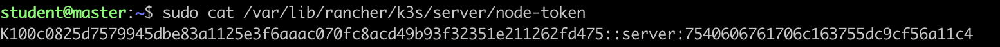
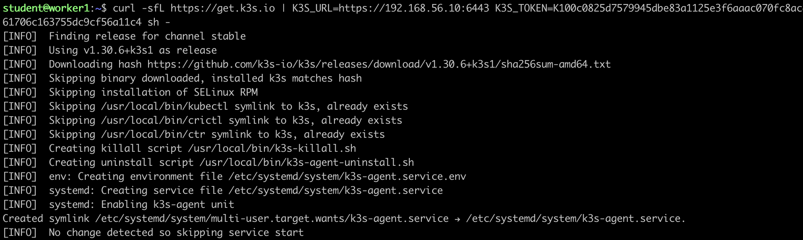
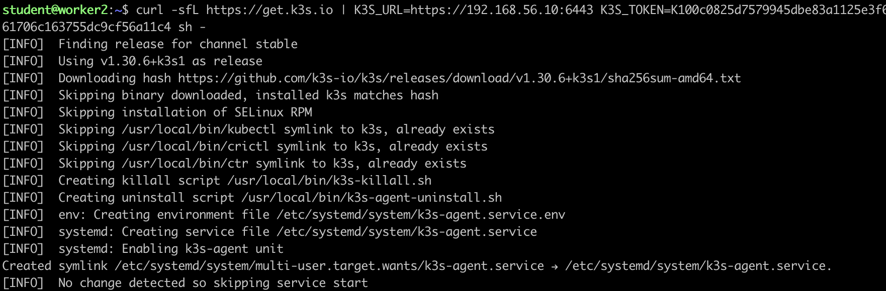
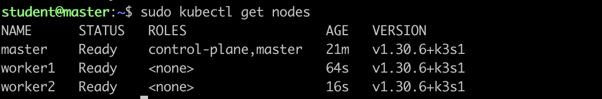

3) Установил Ingress Controller Nginx вместо стандартного. Использовал официальный файл манифеста ingress контроллера на базе nginx, доступный на GitHub.
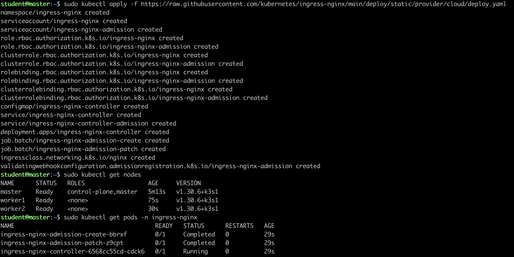

4) Создал локальный домен и сконфигурировал внутри кластера утилиту `cert-manager`, которая должна генерировать wildcard-сертификат для полученного домена
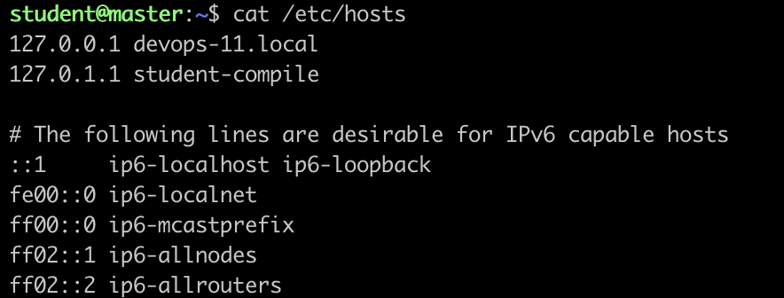
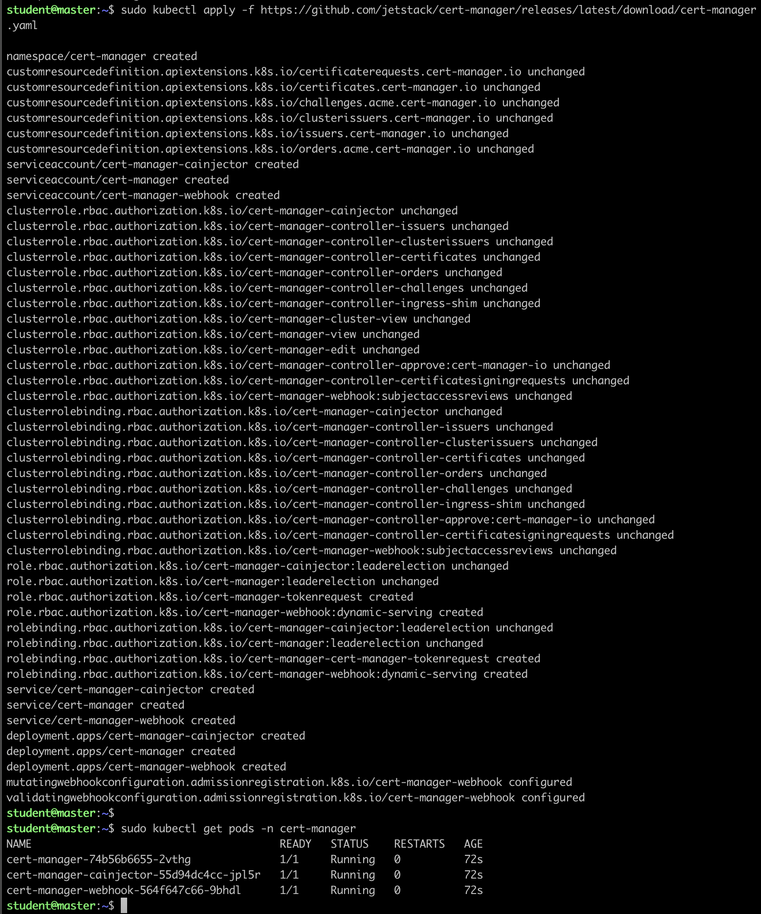
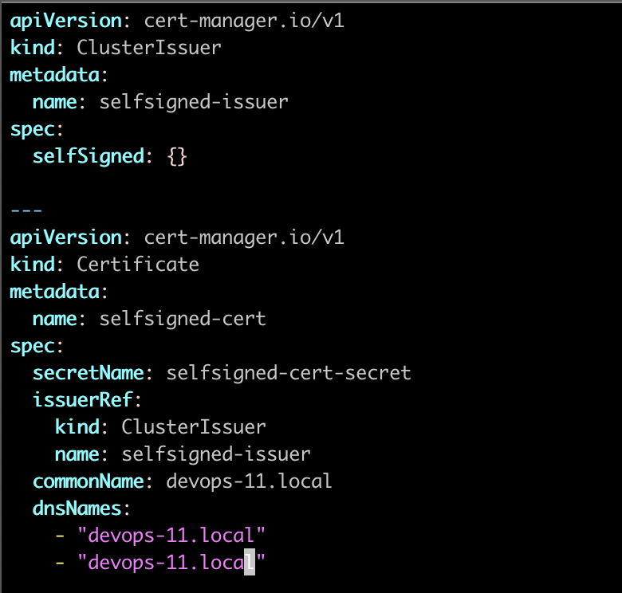

5) Создал ресурс Ingress для своего личного домена и настроить его для использования контроллера nginx ingress и полученного сертификата
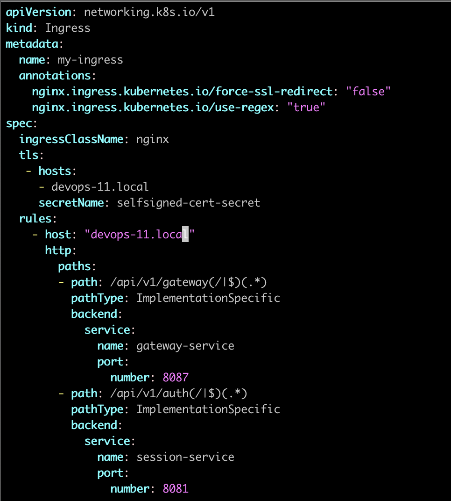

    Убедился, что ingress-controller работает на двух портах(для подключения по http и https)
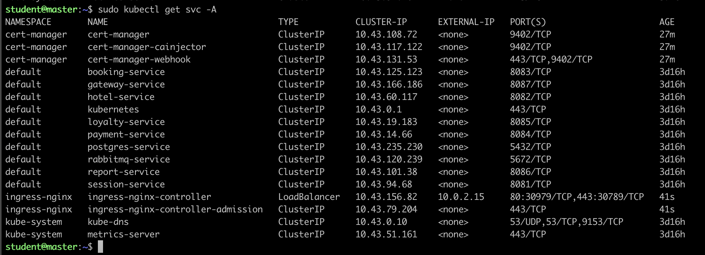

6) Создал PV (Persistent Volume) для базы данных PostgreSQL в манифесте из четвертого проекта.

    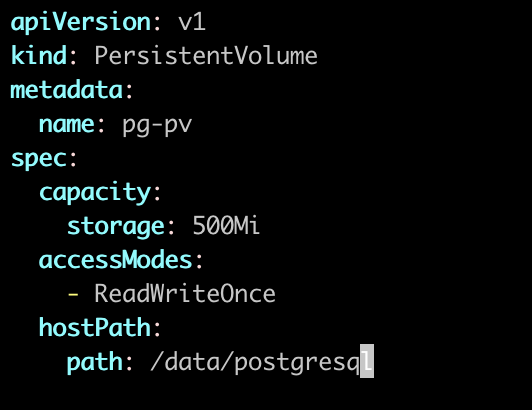

    Убедился, что запрошенное место выделилось.
    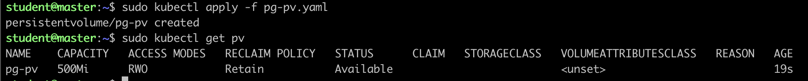

7) Запустил приложение, описанное в манифесте.
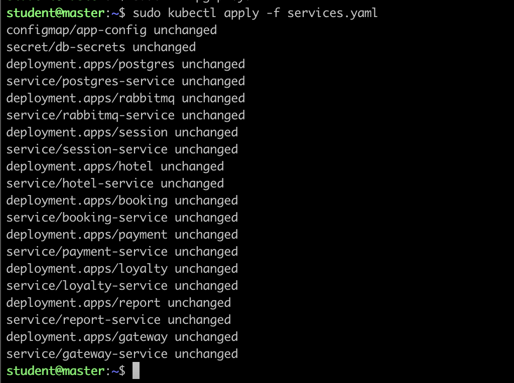
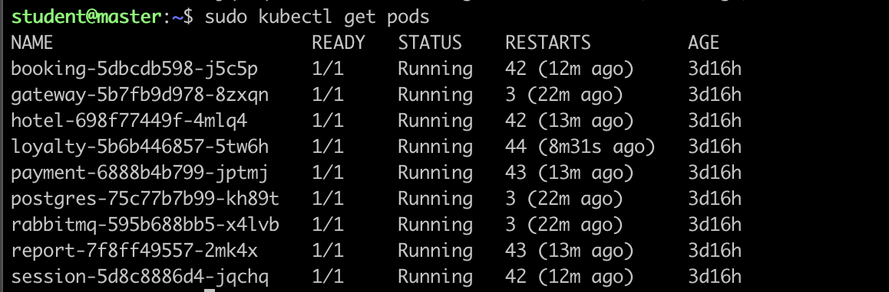

    С помощью *curl* проверил, что домен работает.
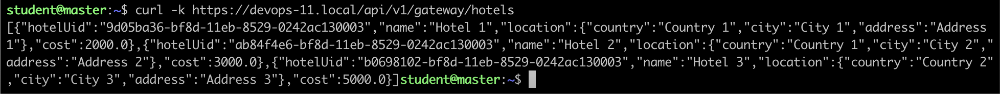

8) Так как проект я выполнял на школьном АРМе, проверить домен на локальной машине я не смог(так как нету прав изменять файл /etc/hosts). Чтобы прогнать сервисы по тестам, я развернул такой же кластер в докер-контейнерах и изменил домен на ***localhost***. На скрине можно увидеть, что подключение по https и порту 443 проходит.
    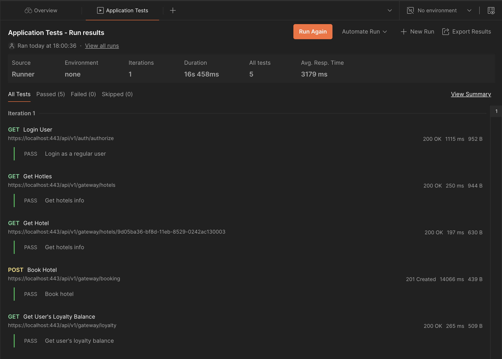

 
9) Установил и запустил Prometheus Operator для сбора метрик в системе. Продемонстрировать в отчете результат выполнения команды `kubectl get pods -n monitoring`
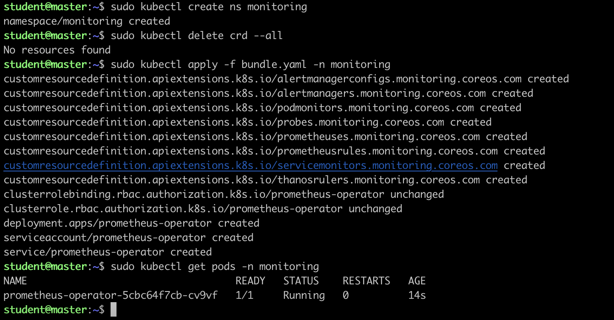
