# Helm и Kustomization

## Part 1. Развертывание приложения с помощью Kustomize

1) С помощью Vagrant получил набор виртуальных машин с развернутым кластером.
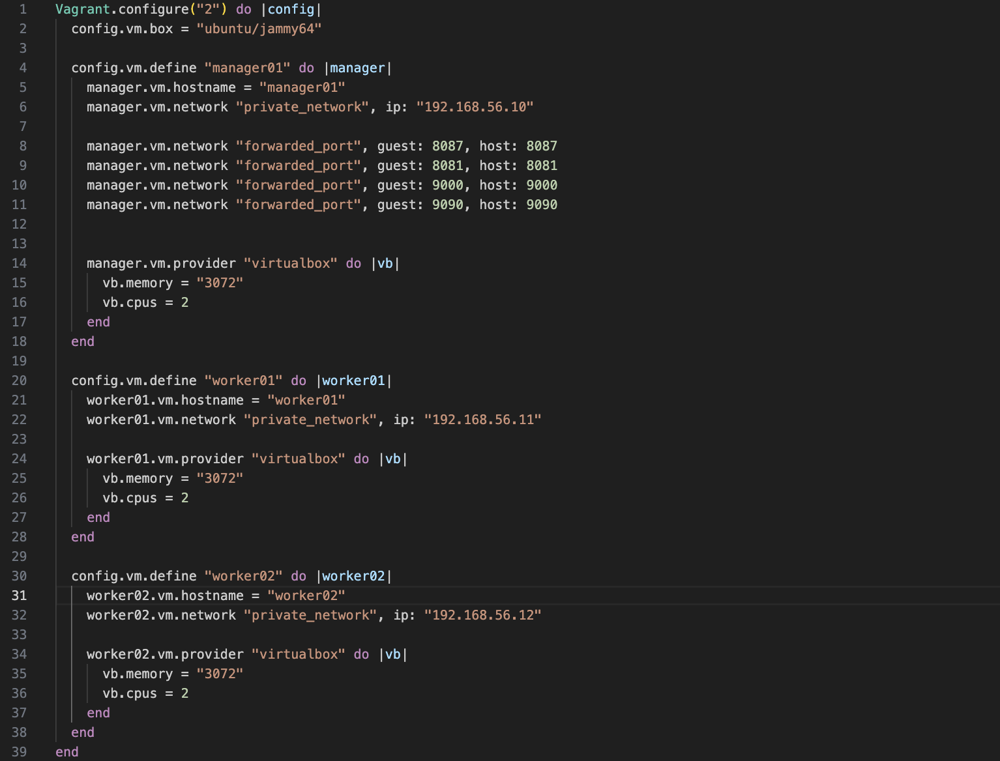
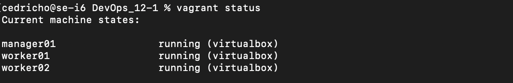

2) Перенес манифесты из предыдущих блоков.
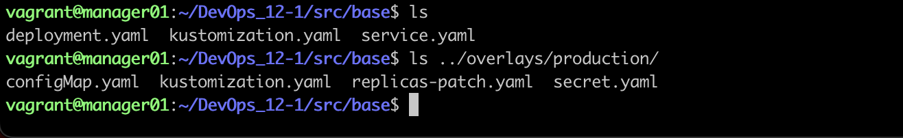

3) Установил *kustomize* на локальной машине.
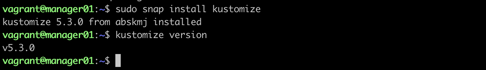


4) Cоздать скелет проекта развертывания с одной базовой конфигурацией (base) и одной оверлейной конфигурацией (production):

    ```
    ├── base
    │   ├── deployment.yaml
    │   ├── kustomization.yaml
    │   └── service.yaml
    ├── overlays
    │   └── production
    │       ├── kustomization.yaml
    │       ├── configMap.yaml
    │       ├── secret.yaml
    │       └── replicas-patch.yaml
    ├── kustomization.yaml
    └── ...
    ```
    

5) Написал базовые и оверлейные конфигурации для kustomize. В базовых указал сервисы и развертывания, в production добавил конкретные секреты и конфигурационные значения.

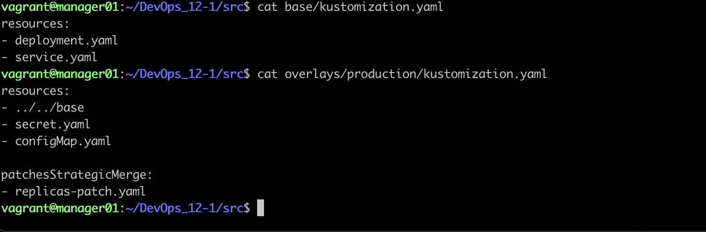

6) Создал `replicas-patch.yaml` для оверлей production, который модифицирует количество реплик для деплоймента gateway service до 3 реплик.
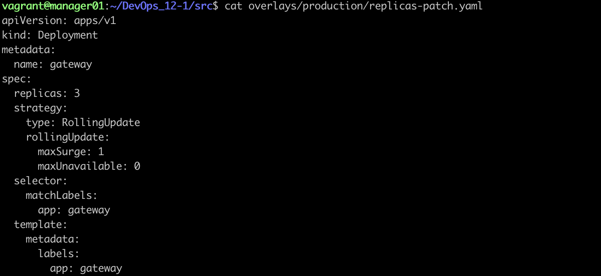

7) Собрал результирующий конфигурационный файл учитывая оверлей `production`.
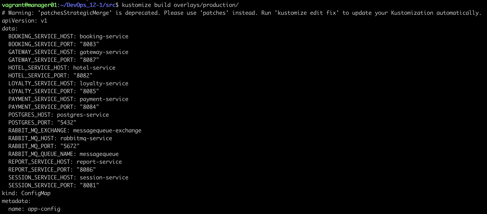

8) Запустил функциональные тесты postman и удостовериться в работоспособности приложения.


## Part 2. Развертывание приложения с помощью Helm

1) Для выполнения этой части использовал машины из первого парта.


2) Перенес манифесты из предыдущих блоков.


3) - Установил ***helm*** на локальной машине. Далее перенес конфигурационный файл k3s в папку .kube с виртуальной машинына локальную.
    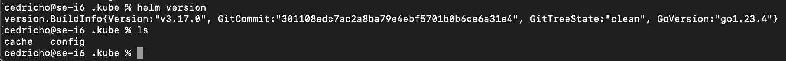
   - В конфигурационном файле изменил адрес сервера на ip-адрес мастер ноды кластера.
    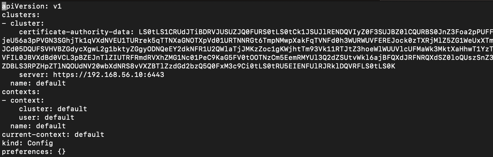
   - Удостоверился, что имею доступ к удаленному кластеру.
    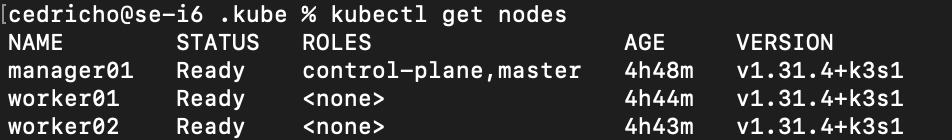
   - Пролинковал путь к конфиг файлу и, для теста helm, добавил репозиторий **stable**, а после установил тестовый пакет ingress-nginx. Далее, на виртуальной машине убедился, что все установилось.
    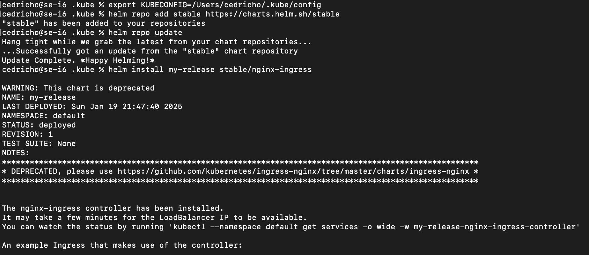
    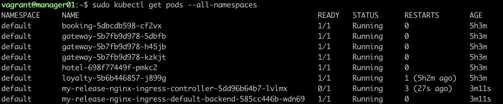

4) Создал *helm*-чарты и шаблоны для своего приложения с помощью команды `helm create`.


5) Отредактировал файл `values.yaml` на диаграмме, чтобы указать параметры конфигурации для приложения, необходимые для создания манифестов Kubernetes для указанных развертываний (deployments). Описал объекты развертывания и сервисов в директории шаблонов (templates).
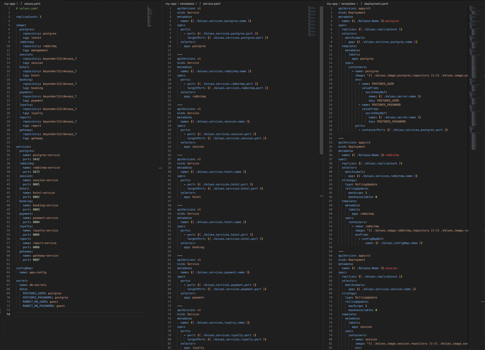

6) Упаковал *helm*-чарт с помощью команды `helm package` для создания файла `*.tgz`, содержащего чарт и его зависимости.
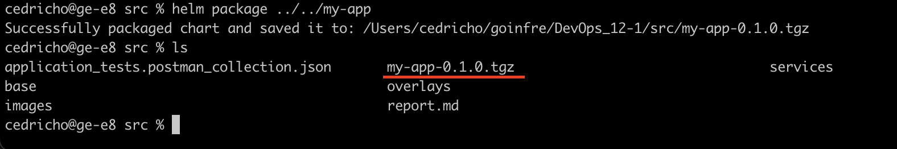

7) Развернул *helm*-чарт в кластере Kubernetes с помощью команды `helm install`. Указать произвольный `namespace` и `release-name`.
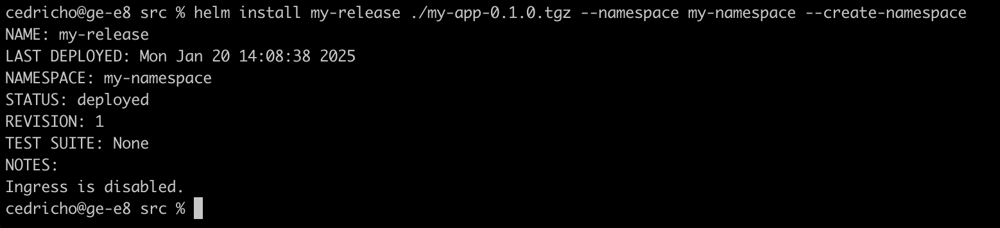

8) Проверил статус развернутого приложения при помощи команды `kubectl get`.
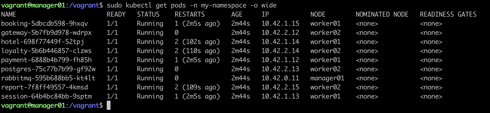

9) Внес изменение в `values.yaml`(увеличил количество реплик gateway) и выполнил команду `helm upgrade`.

    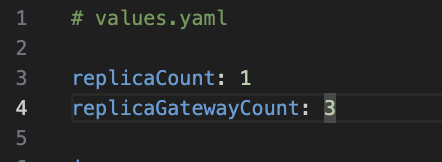
    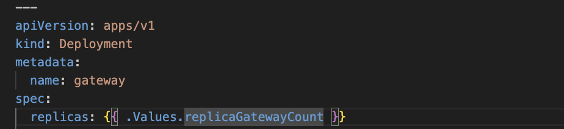
    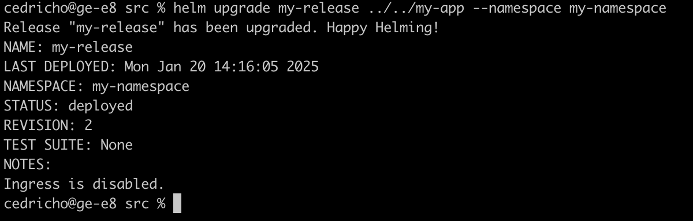
    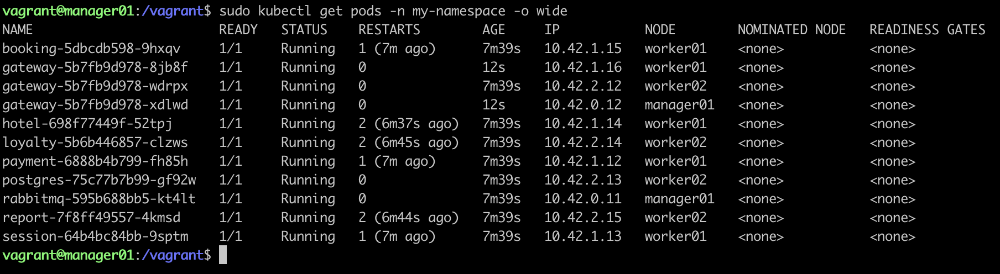

10) Запустил функциональные тесты postman и удостоверился в работоспособности приложения.
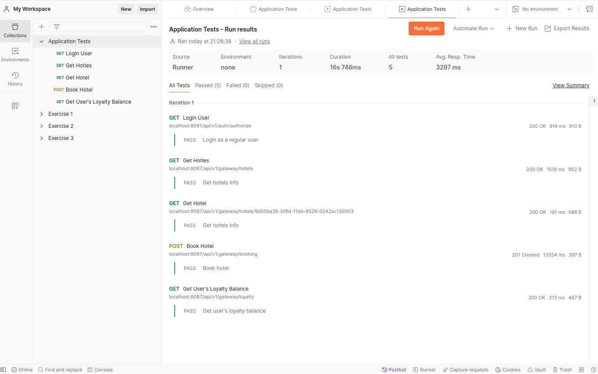
