# DevOps. Project 7
## Part 1. Запуск нескольких docker-контейнеров с использованием docker compose

* При написании ***Dockerfile*** я пользовался методом локальной сборки jar-пакетов. Для всех сервисов Dockerfile получился практически одинаковым.
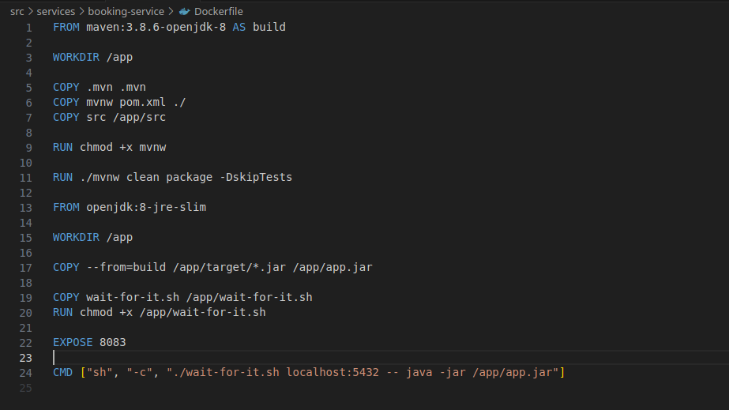

* После сборки у меня получились образы слудующих размеров.

    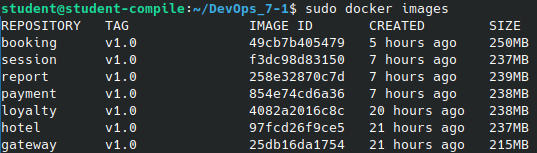

* Далее написал ***docker-compose.yml*** для поднятия баз данных, очереди сообщений и самих сервисов.
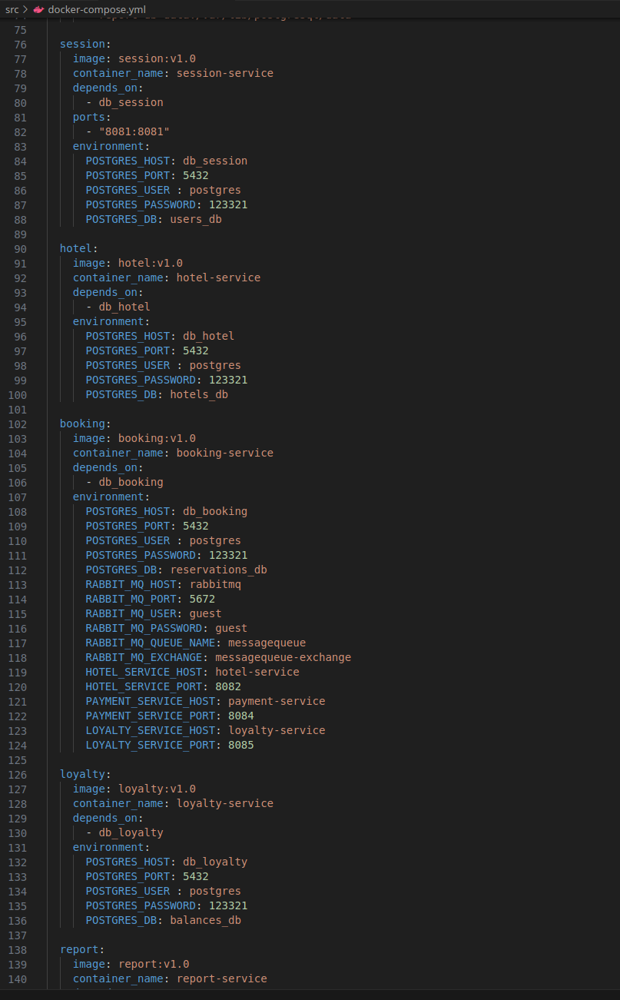

* С помощью команды **docker compose up** поднял все контейнеры и бд.
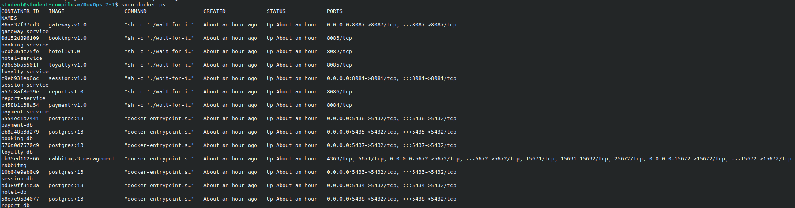

* В заключении первого задания проверил тестами, что у меня действительно все работает.
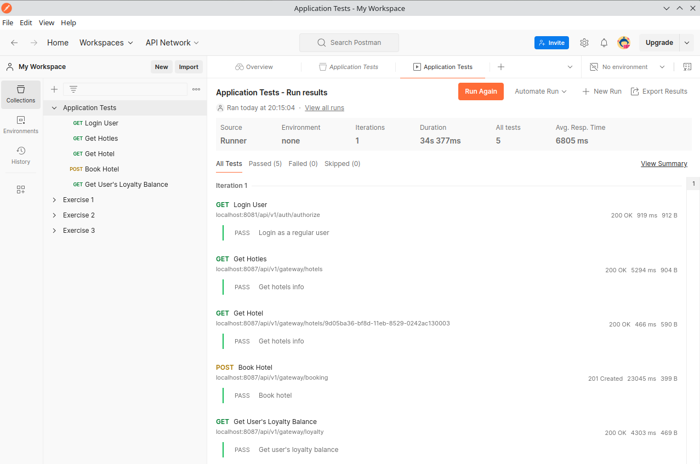

## Part 2. Создание виртуальных машин

* Установил **Vagrant** и, с помощью команды ***vagrant init ubuntu/bionic64***, проинициализировал его. В качестве ОС вирутальной машины использовал *Ubuntu 18.04 LTS(bionic64)*.
    
    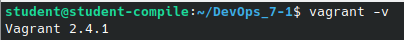
    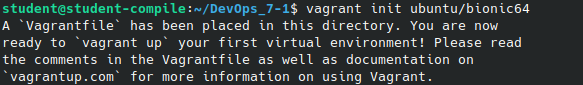

* В **Vagrantfile** раскомментировал строку для синхронизации текущей директории с директорией внутри виртуальной машины.
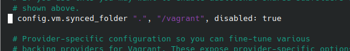

* Для запуска машины использовал ***vagrant up***. Далее, с помощью команды ***vagrant ssh***, зашел внутрь и проверил что директория с исходным кодом действильно скопировалась.

    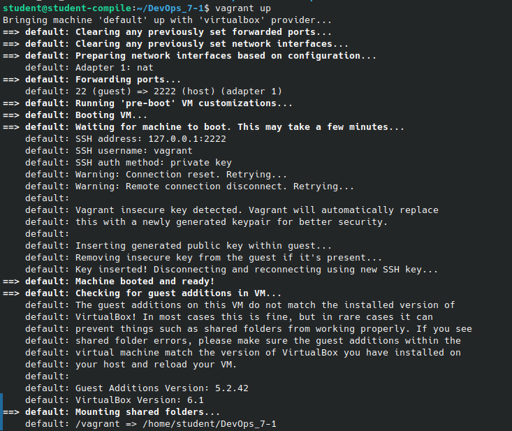
    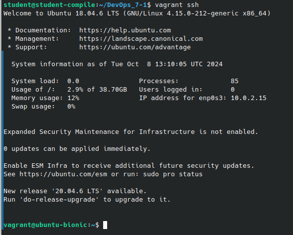
    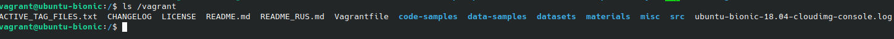

* Чтобы остановить и уничтожить машину использовал команду ***vagrant destroy***.
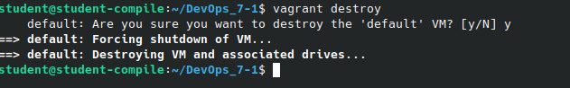

## Part 3. Создание простейшего docker swarm

* Написал **Vagrantfile** для создания трех машин: manager01, worker01, worker02. В нем же прописал shell-скрипты для установки docker. Для инициализации docker swarm использовал команду ***docker swarm init --advertise-addr*** в менеджере, а в воркерах для подключения использовал ***docker swarm join --token***.
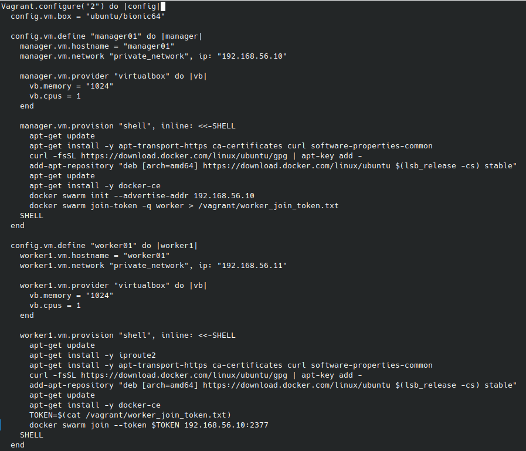
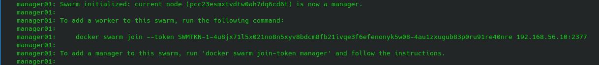

* Для того, чтоюы загрузить собранные образы на docker hub, я использовал следующие команды: ***docker tag*** и ***docker push*** для создания тега и пуша соответственно.
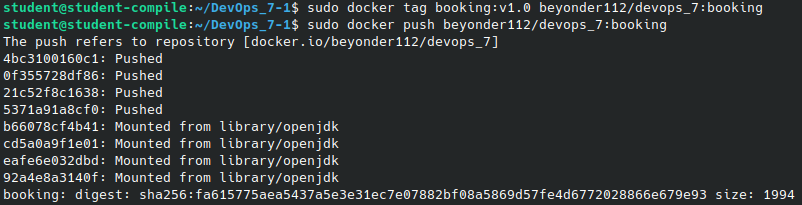
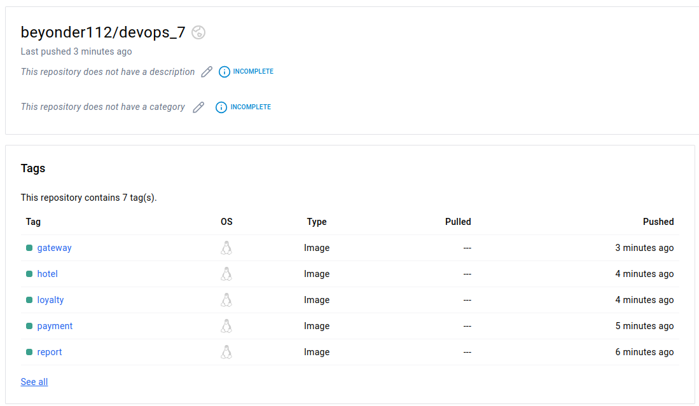

* Далее изменил docker-compose, чтобы брать образы из docker hub.
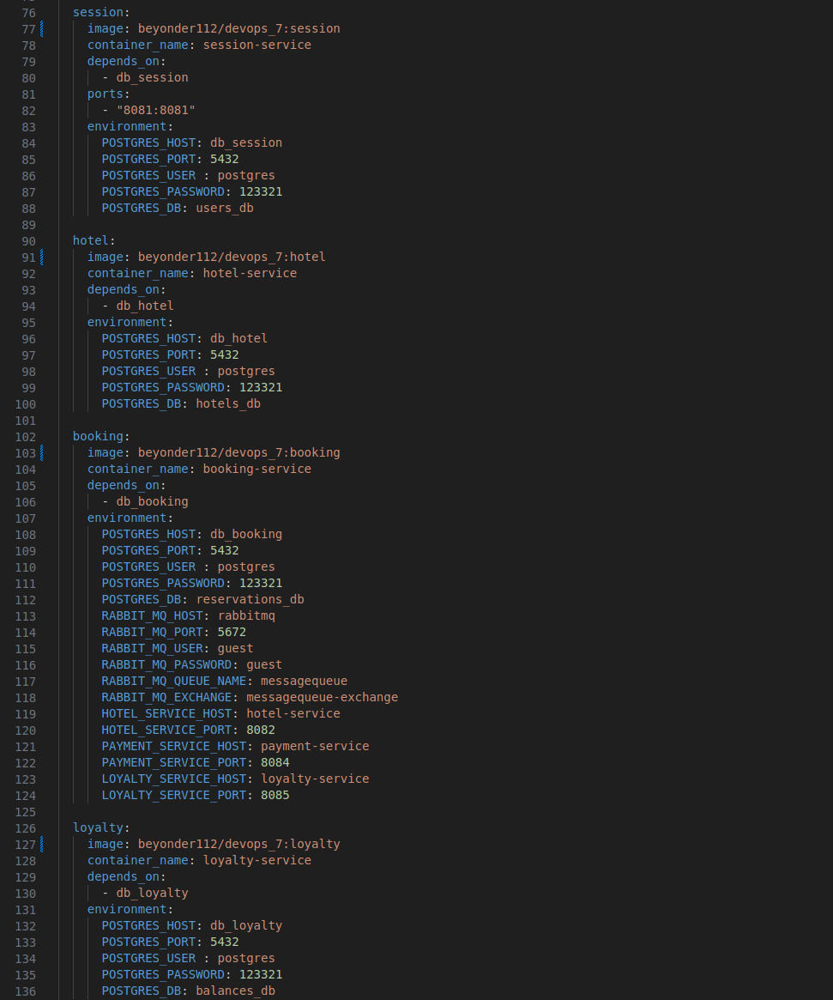

* Запустил 3 вирутальные машины и подключился к менеджеру.

    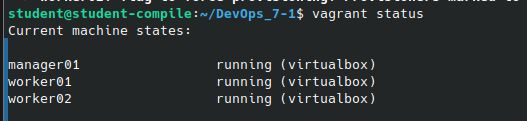

* Перенес docker-compose.yml, и поднял все сервисы на менеджере с помощью команды ***docker stack deploy -c docker-compose.yml***.
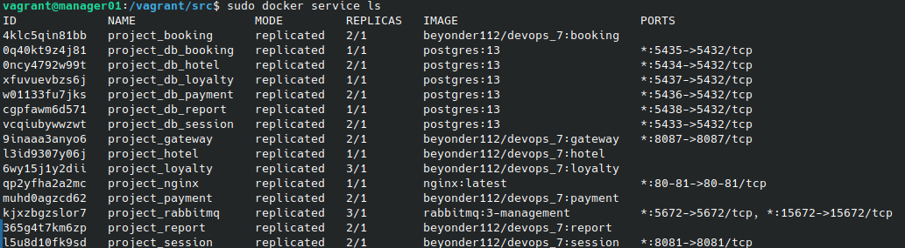

* В docker-compose.yml удалил строки с ports, чтобы эти сервисы не были доступны напрямую из внешней сети. Далее добавил сервис Nginx как обратный прокси.

    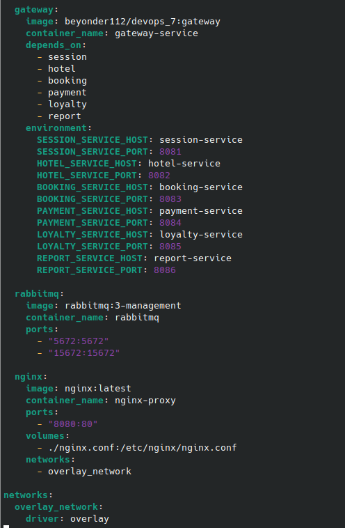
    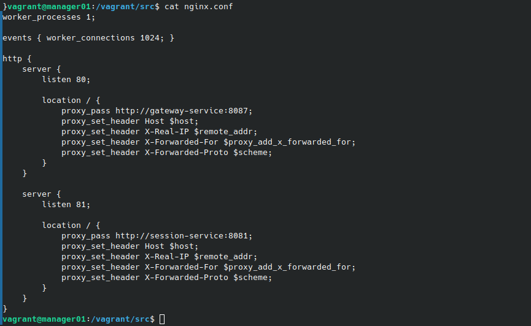

* Проверил результат работы тестами в Postman.

* Используя команды docker увидел распределение сервисов по узлам.

    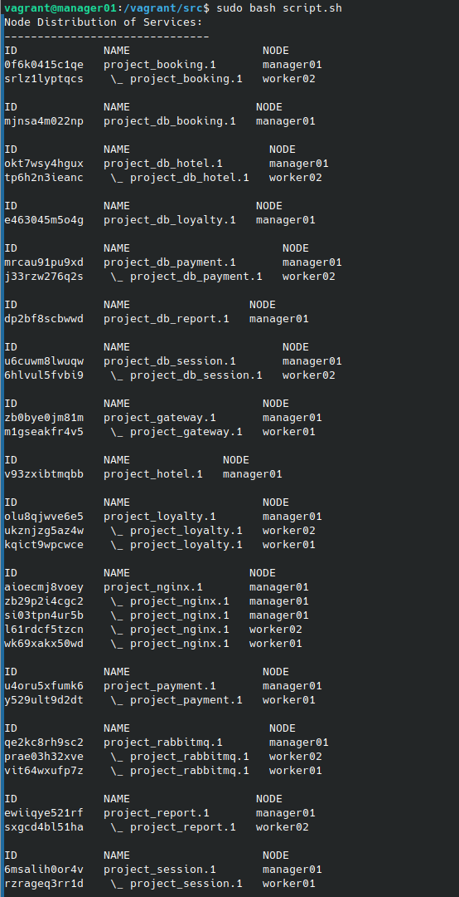

* Установил отдельным стеком Portainer внутри кластера.

    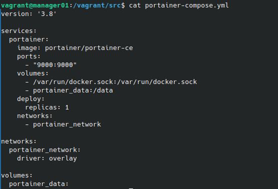
    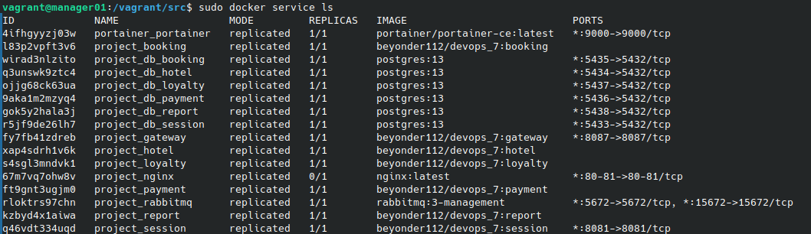
    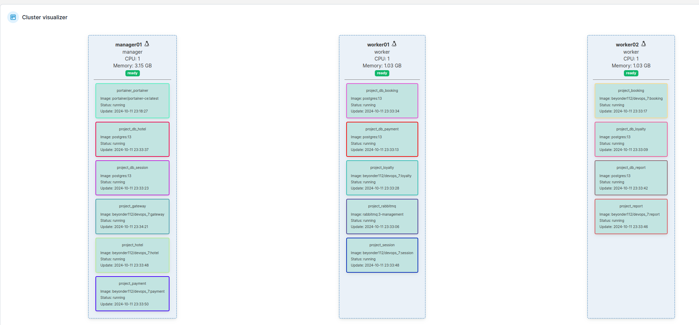
