# Monitoring

## Part 1. Получение метрик и логов
1) Взял Vagrantfile и docker-compose.yml из проекта *DevOps. Project 7*. В Vagrantfile пробросил порт 9090 для проверки Prometheus в браузере.
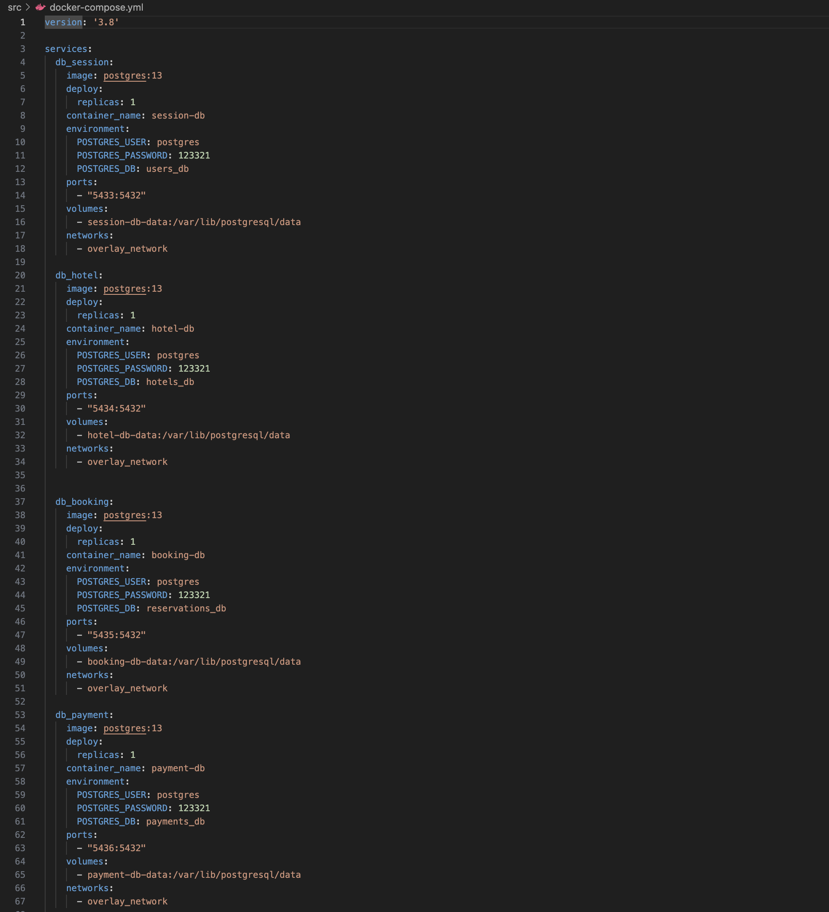
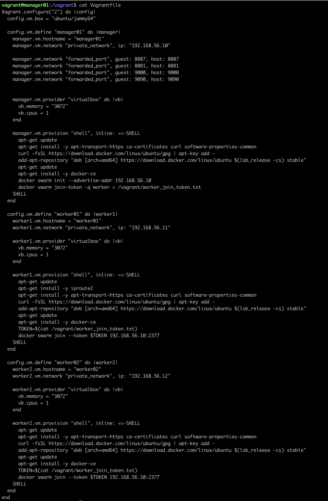

2) С помощью библиотеки Micrometer написал сборщики метрик приложения. Для этого добавил нужные зависимости и подключил библиотеку Micrometer в скриптах сервисов.
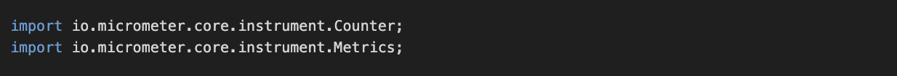
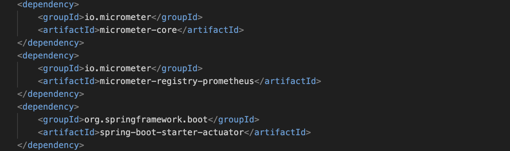

* Далее создал сборщик метрик.
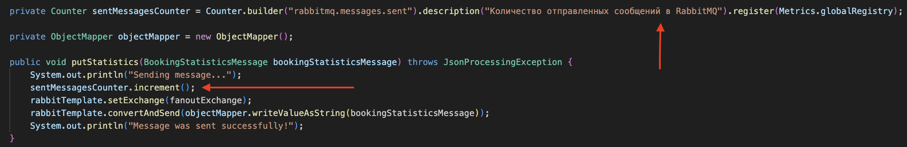

3) Добавил логи приложения с помощью Loki. Для этого добавил сервис ***loki*** в docker-compose.yml и в приложении все логи отправляю напрямую в ***Loki***.
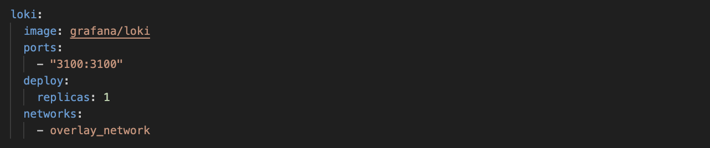
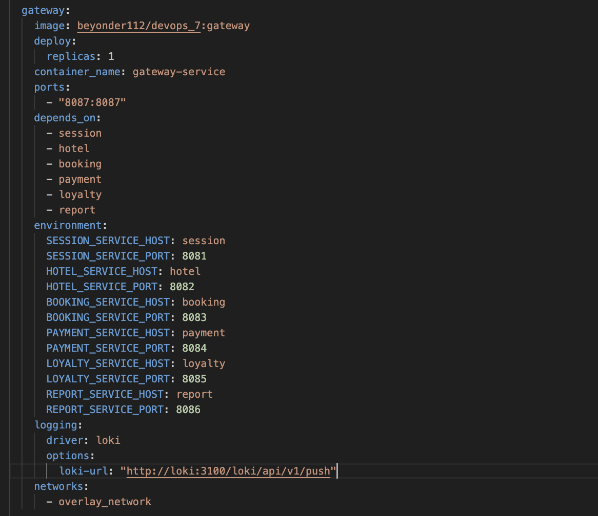

4) Добавил в docker-compose.yml новые сервисы.
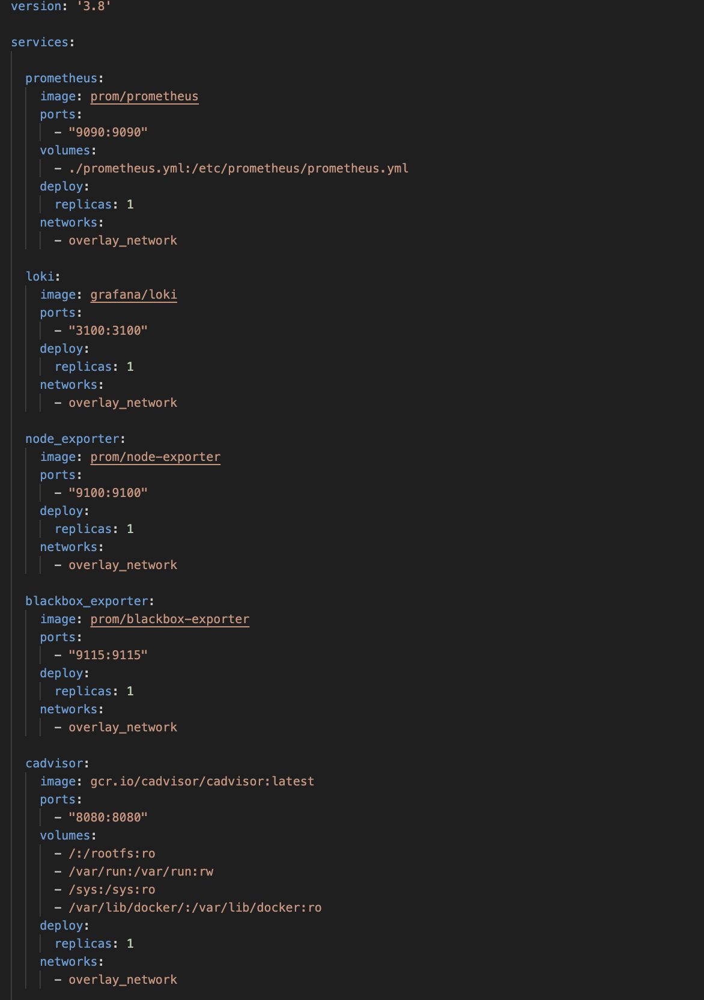

* Запустил новый стек и проверил распределение по узлам.
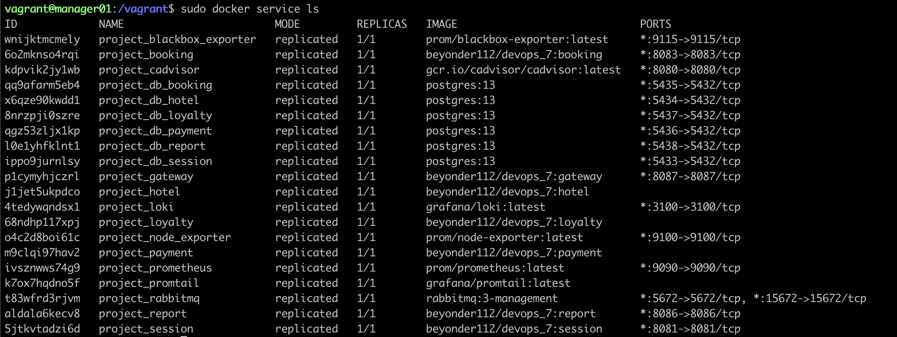
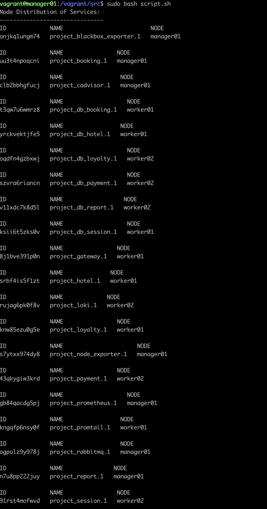

* Проверил получение метрик на порту 9090 через браузер.
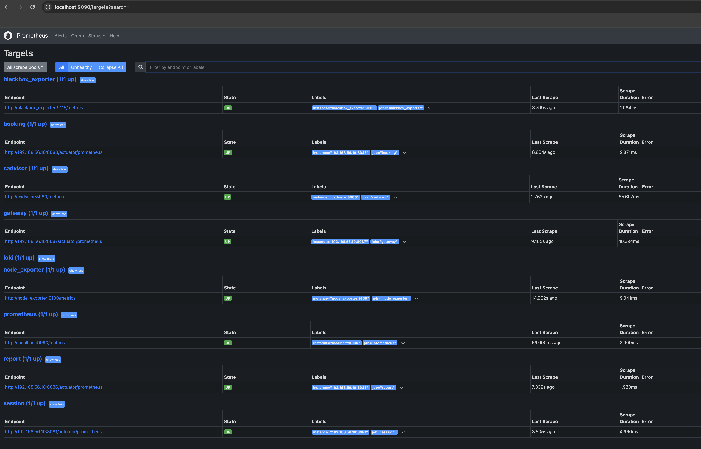
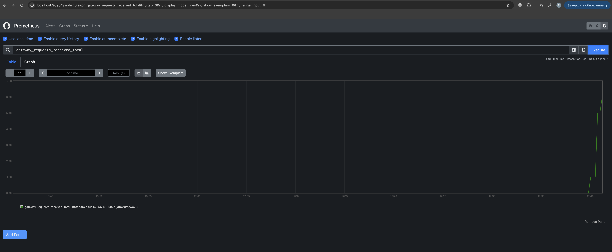

## Part 2. Визуализация

1) Развернул grafana как новый сервис в стеке мониторинга.
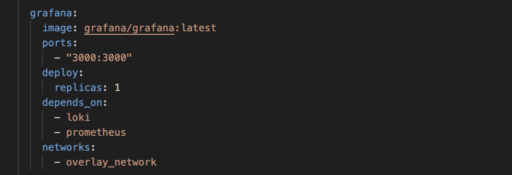

* В прометеус добавил сбор необходимых метрик.
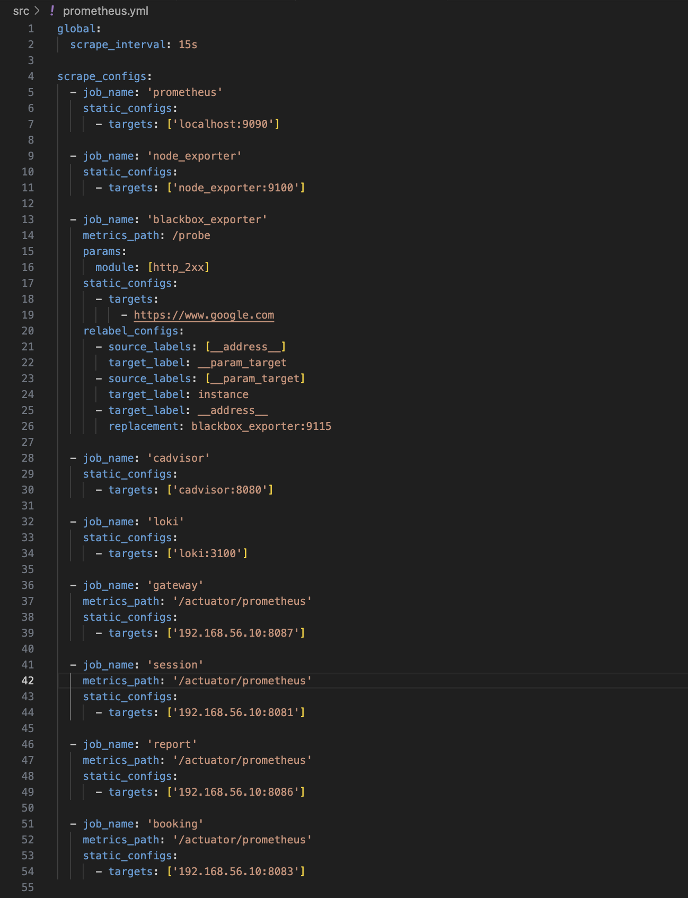

2) Добавил в grafana дашборд со следуюшими метриками:

    - количество нод;
    - количество контейнеров;
    - количество стеков;
    - использование CPU по сервисам;
    - использование CPU по ядрам и узлам;
    - затраченная RAM;
    - доступная и занятая память;
    - количество CPU;
    - доступность google.com;
    - количество отправленных сообщений в rabbitmq;
    - количество обработанных сообщений в rabbitmq;
    - количество бронирований;
    - количество полученных запросов на gateway;
    - количество полученных запросов на авторизацию пользователей;
    - логи приложения.

    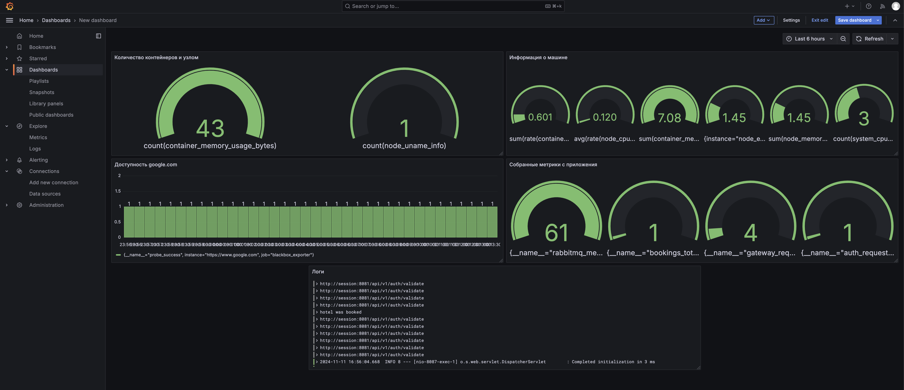

## Part 3. Отслеживание критических событий

1) Развернул alert manager как новый сервис в стеке монтиторинга.
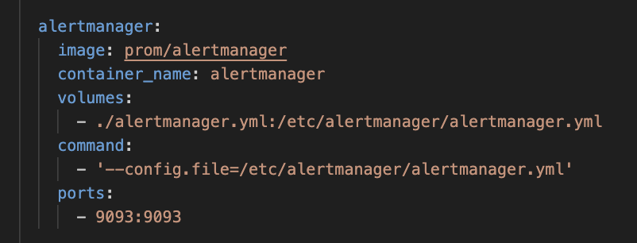

* Добавил менеджер в прометеус

    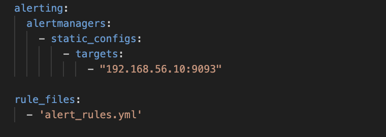

2) Добавил следующие критические события:
    - доступная память меньше 100 мб;
    - затраченная RAM больше 1гб;
    - использование CPU по сервису превышает 10%.

    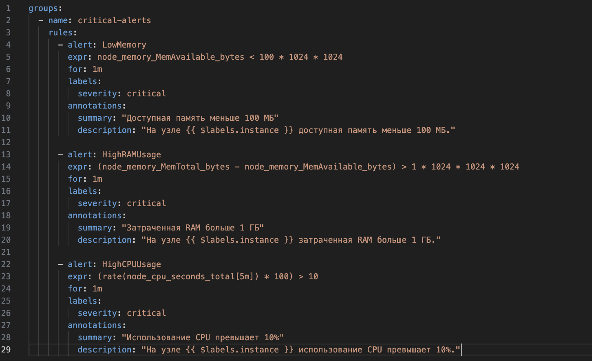

3) Настроил получение оповещений через личные email и телеграм.
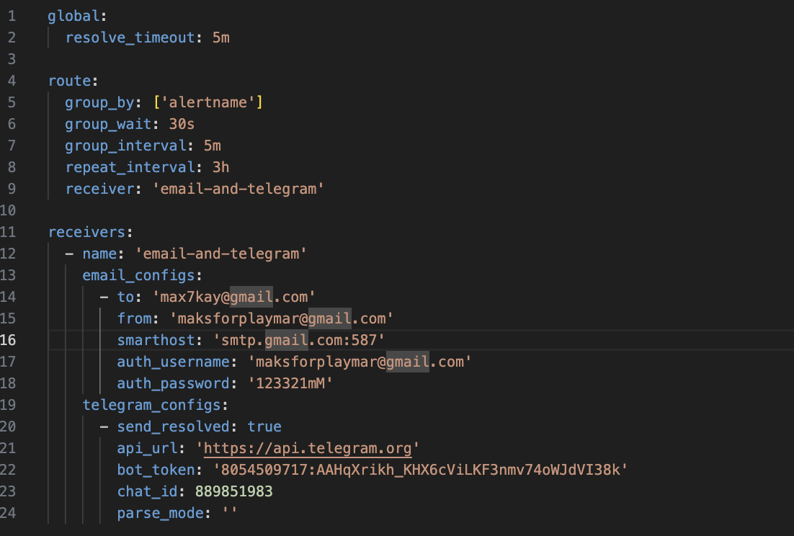

* Убедился, что все работает
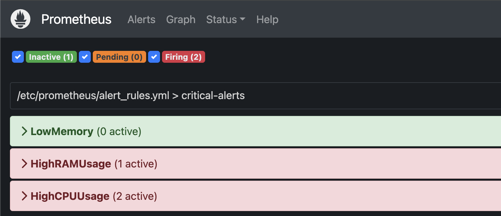
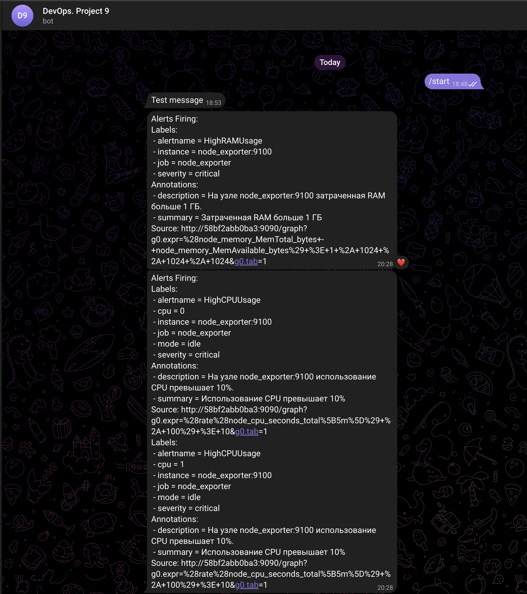
