# Continuous integration and delivery

## Part 1. CI and CD setup

1) Склонировал рабочий репозиторий и с помощью вагранта создал 3 вирутальные машины на которых развернул кластер Kubernetes.
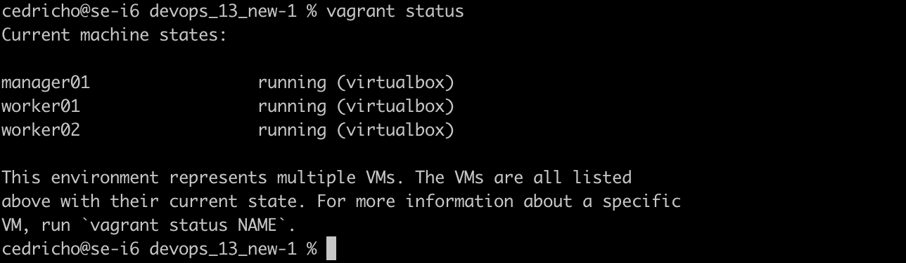
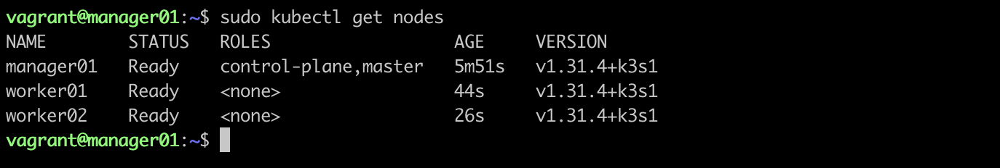

2) Перенес конфигурационный файл на локальную машину и изменил адресс сервера для получения доступа к удаленному кластеру.
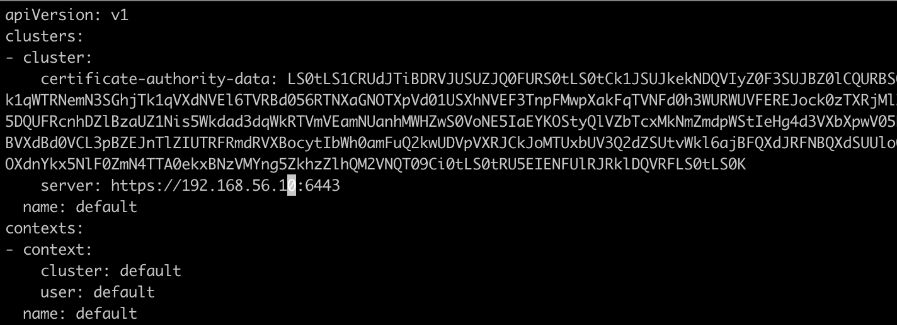
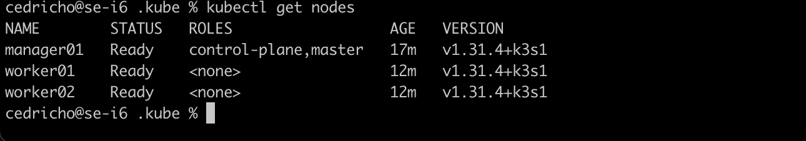

3) Создал отдельный неймспейс для раннера gitlab.

4) Установил gitlab-runner с помощью helm-чарта. В файле значений указал URL и Token репозитория gitlab.
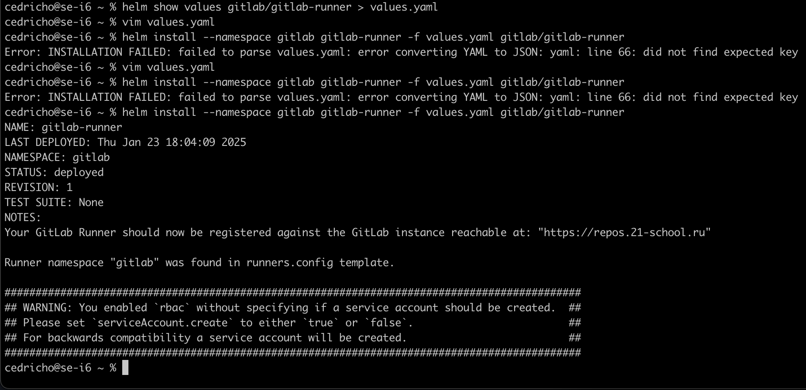
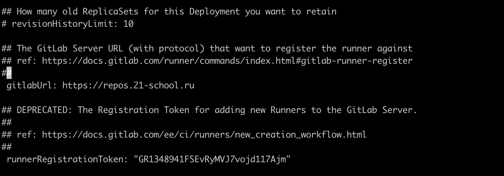

5) Создал секрет для хранения регистрационного токена gitlab.
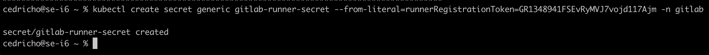

6) Создал конфигурационный файл `config.toml` для использования установленного на выданном кластере kubernetes раннера. Там же указал ограничения по ресурсам и докер-образ (`docker:stable`). Зарегистрировал установленный раннер при помощи написанного конфигурационного файла.
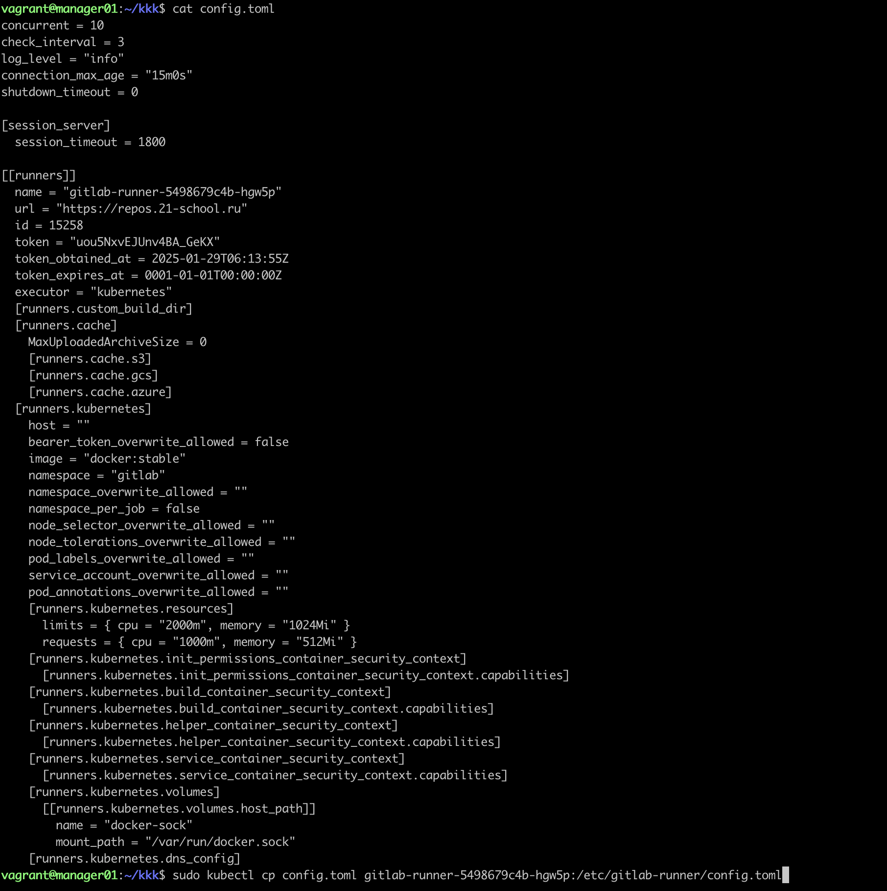
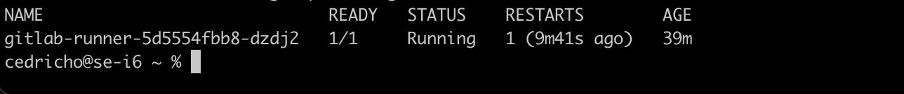

7) Разработал следующий пайплайн:

- build - сборка приложения (запускать автоматически для веток с префиском `feature_`)
- test - запуск модульных тестов и функциональных тестов postman через утилиту newman (запускать автоматически для веток с префиском `feature_`)
- staging - запуск приложения в staging-окружении (запускать мануально и только для тегов)
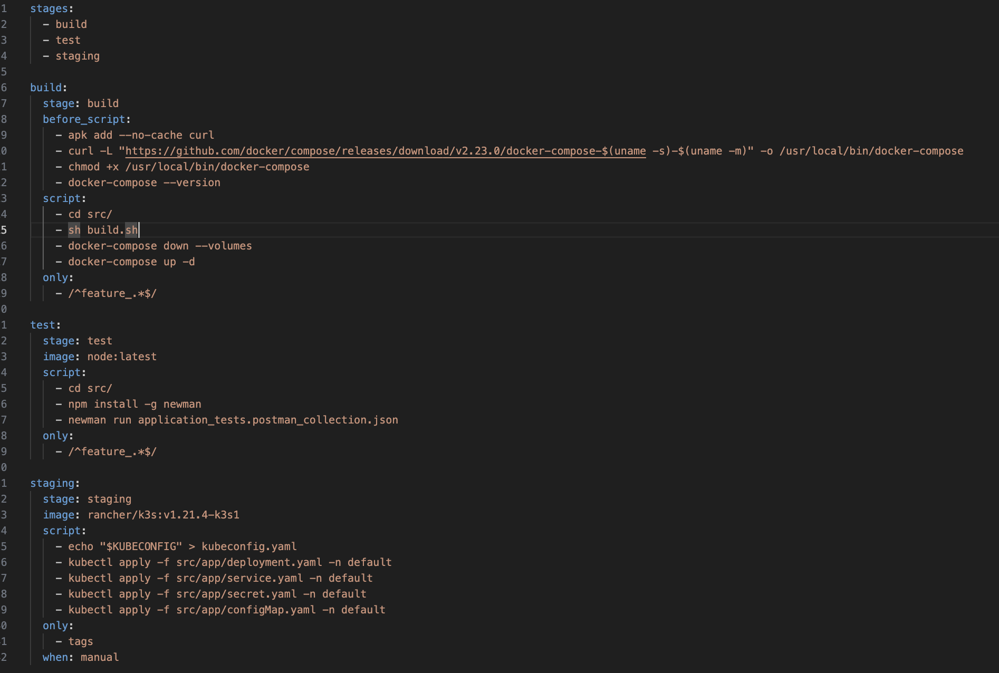
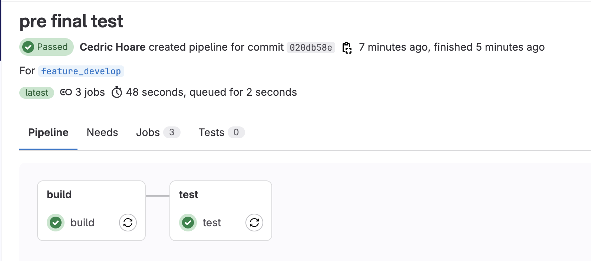
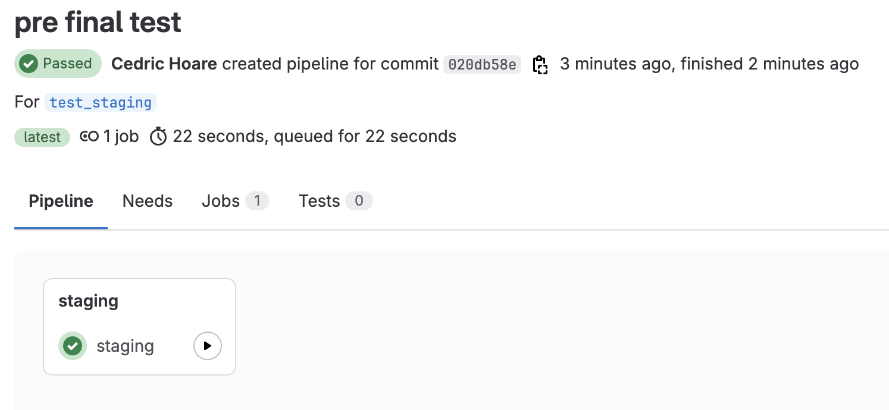
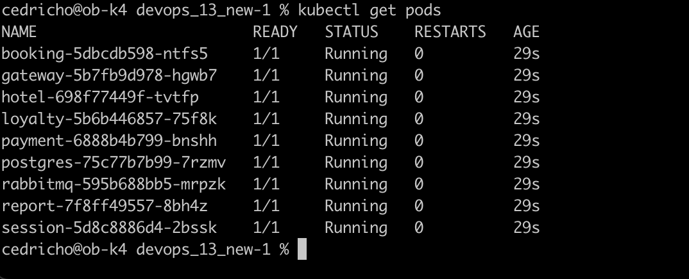

8) Использовал секреты для передачи приватных ключей сервисам для авторизации (файл application.properties в директории с исходным кодом сервисов).
    - Создал секрет с приватным ключом
    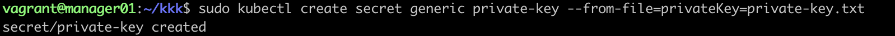
    - Для стадии ***build*** смонтировал секрет в под гитлаб-раннера, чтобы его использовать в docker compose
    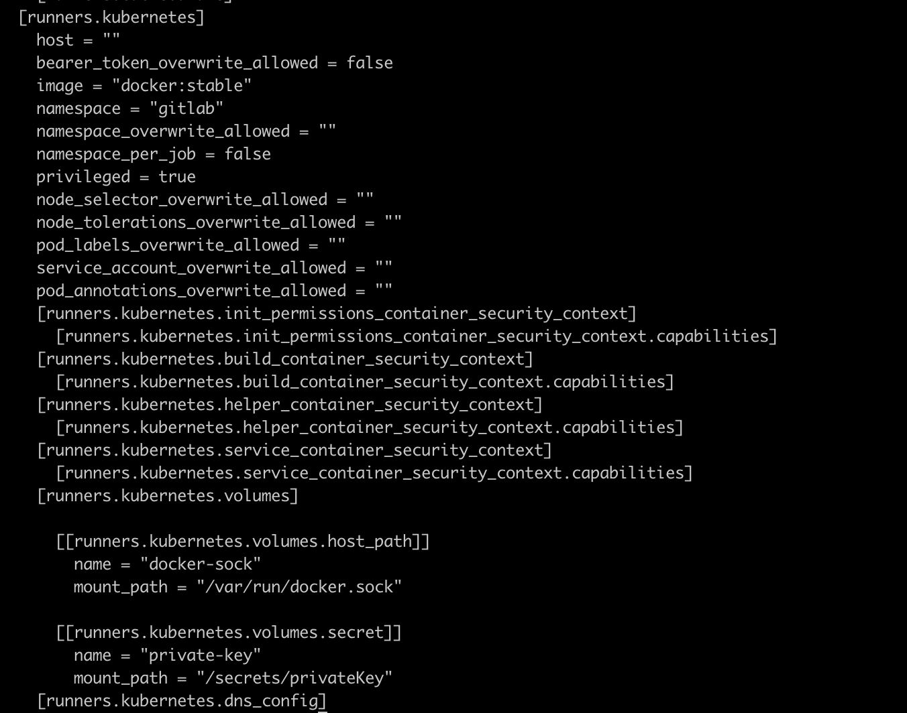
    - Для стадии ***staging*** добавил переменную окружения *PRIVATE_KEY*, которая берет значение секрета
    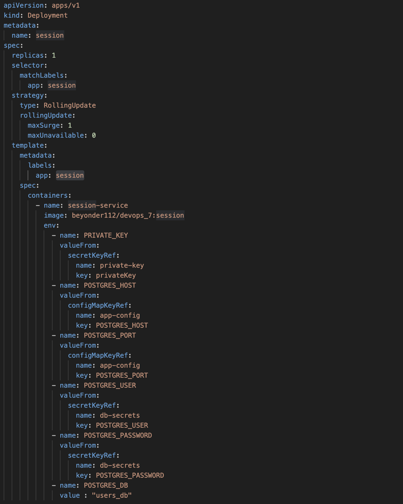
    - В **application.properties** изменил значение *privateKey*
    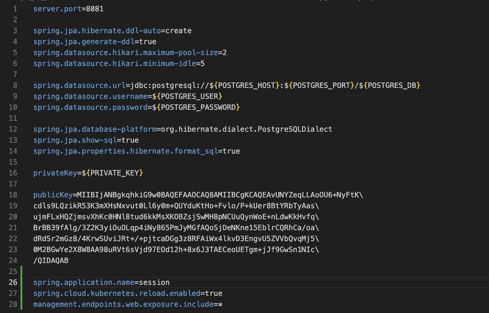
    - Убедился, что все работает

        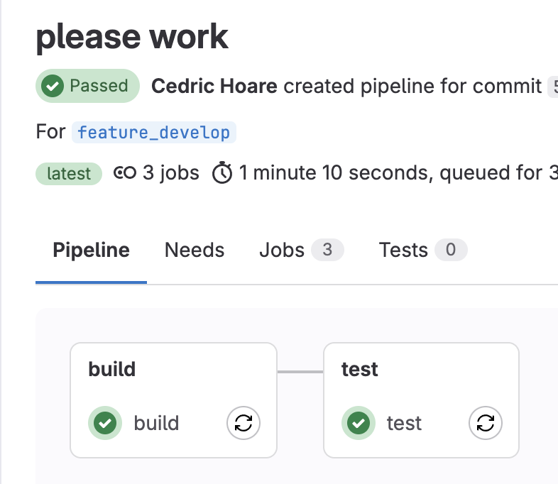 
        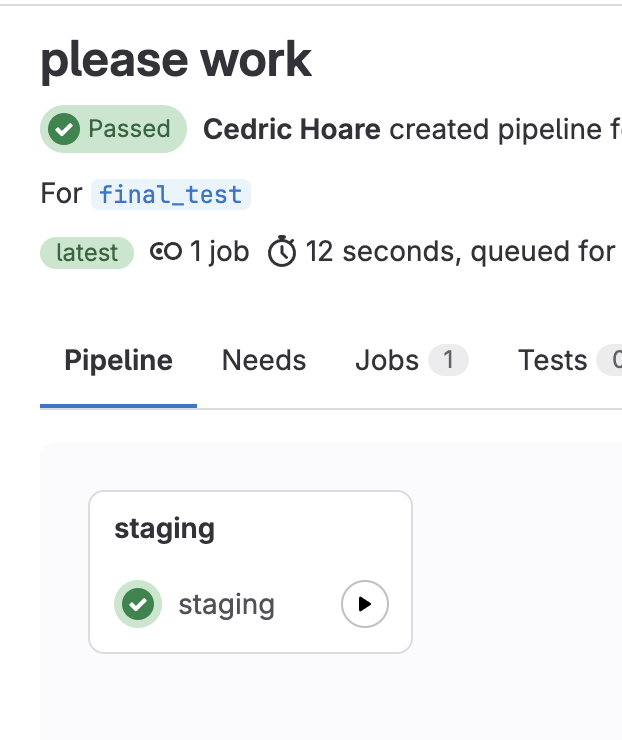

9) Внес изменение в код приложения. Добавил новую зависимость(Spring Cloud Kubernetes для работы с секретами и конфигурацией) в pom.xml файл и зафиксировать изменение. Также дописал две команды, чтобы автоматически перезагружать приложение при изменении секрета.

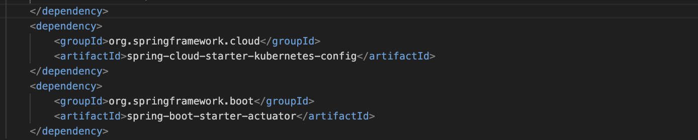
